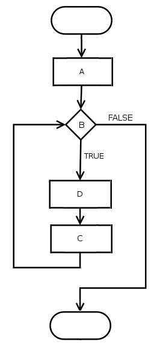

Wprowadzenie
============

ALGORYTMY + STRUKTURY DANYCH = PROGRAMY

PROGRAMOWANIE = ROZWIĄZYWANIE PROBLEMÓW

Wytwarzanie oprogramowania jako proces, który ma na celu dostarczenie produktu.

Koncepcja (specyfikacja) > Architektura (projekt) > Implementacja (realizacja) > Integracja (konsolidacja) > Test

Metodologie:

 - model kaskadowy (waterfall)
 - model przyrostowy (iteracyjny)
 - programowanie zwinne (agile, scrum, kanban, xp)

DDD (domain driven development)

TDD (test driven development)

Kompilacja
----------

Kompilacja to proces tłumaczenia kodu źródłowego języka programowania, na odpowiadający mu kod w języku wynikowym. Zwykle źródłowym jest język wysokiego poziomu, zaś wynikowym język niższego poziomu.

Zwykle językiem wynikowym w procesie kompilacji jest kod języka maszynowego dla platformy fizycznej lub wirtualnej.

Kompilacja może być bezpośrednia, w wyniku której powstaje ostateczny kod maszynowy lub taka,
w której produkowany jest pośredni kod w języku C lub asemblera, przekształcany w kolejnym etapie na wynikowy kod maszynowy.  

Transpilacja
------------

Jest to rodzaj kompilacji, która polega na przetworzeniu kodu źródłowego na równoważny kod w innym języku programowania lub w innym dialekcie tego samego języka.

To co odróżnia transpilację od tradycyjnej kompilacji jest różnica poziomów abstrakcji między językiem źródłowym, a wynikowym.
O ile kompilacja daje w wyniku kod o niższym poziomie abstrakcji, zbliżonym do natywnego kodu dla danej platformy sprzętowej, w procesie transpilacji kod wynikowy jest z reguły na podobnym poziomie abstrakcji.

Konsolidacja
------------

Konsolidacja (łączenie) jest procesem polegającym na połączeniu skompilowanych części programu (moduły, biblioteki)
i utworzeniu postaci wykonywalnej.

Budowanie
---------

Budowanie jest procesem prowadzącym do wytworzenia wynikowego rozwiązania zawierającego wszystko, co jest potrzebne do uruchomienia programu.

W najprostszym przypadku proces budowania może być równoznaczny z kompilacją i konsolidacją, której wynikiem jest gotowy do uruchomienia w systemie operacyjnym plik wykonywalny.

W bardziej skomplikowanym przypadku proces budowania może oprócz kompilacji i konsolidacji przeprowadzić dodatkowe operacje takie jak transpilacje, konwersje, pobieranie wymaganych bibliotek, utworzenie pakietu wykonywalnego, czy wygenerowanie pakietu instalacyjnego.

Do tego celu stosuje się narzędzia automatyzacji procesu budowania.

Przepływ sterowania
-------------------

Przepływem sterowania nazywamy kolejność w jakiej  instrukcje lub wywołania funkcji są wykonywane.

Paradygmaty programowania
-------------------------

Znaczenie słowa "paradygmat": "przyjęty sposób widzenia rzeczywistości w danej dziedzinie" ([sjp.pl](https://sjp.pl/Paradygmat)).

Paradygmaty programowania są sposobem klasyfikacji języków programowania na podstawie ich cech ([en.wikipedia.org](https://en.wikipedia.org/wiki/Programming_paradigms)).

Paradygmaty mogą określać w jaki sposób definiowany jest model wykonania oraz jak model ten określa kolejność wykonywanych operacji.

Niektóre paradygmaty mogą dotyczyć tylko składni i gramatyki języka, czy sposobu grupowania kodu.

Języki programowania są zatem klasyfikowane do wielu paradygmatów.

Popularne paradygmaty programowania:

 - imperatywny

 - deklaratywny

 - strukturalny

 - proceduralny

 - obiektowy

 - funkcyjny

 - refleksyjny

Programowanie imperatywne
-------------------------

Program jako sekwencja instrukcji zmieniająca stan maszyny.

Przykładem może być skrypt powłoki (plik wsadowy) zawierający serię poleceń do wykonania.

Programowanie deklaratywne
--------------------------

Program zdefiniowany jest w formie deklaracji tego, co należy wykonać.  

Programowanie strukturalne
--------------------------

Instrukcje pogrupowane są w bloki oraz podprogramy.

Struktury kontrolne takie jak "wybór", czy "iteracja" umożliwiają zbudowanie dowolnego programu.

Programowanie proceduralne
--------------------------

Program podzielony jest na procedury.

Programowanie obiektowe
-----------------------

W programowaniu obiektowym funkcjonalności są przypisane do określonych struktur danych poprzez klasy lub prototypy.

Programowanie funkcyjne
-----------------------

Program zdefiniowany jest jako zbiór funkcji, a działania wykonywane są jako proces wyznaczania wartości tych funkcji.

Programowanie refleksyjne
-------------------------

Wykonanie może być uzależnione od cech określonych w kodzie źródłowym.

Dzięki mechanizmowi refleksji program w czasie wykonania ma dostęp do środowiska uruchomieniowego w celu pobierania informacji o istniejących obiektach bądź dynamicznego tworzenia nowych obiektów.
