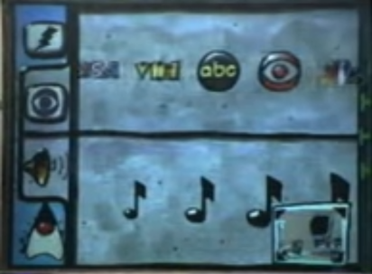

Krótka historia
===============

Java została stworzona w firmie Sun Microsystems w latach 1991-1996.

W roku 1989 James Gosling (znany dziś jako "ojciec Javy") tworzy język programowania **Oak**, początkowo na potrzeby oprogramowania dekodera telewizyjnego (STB).

W roku 1991 Patrick Naughton, Mike Sheridan oraz James Gosling rozpoczynają prace nad platformą programistyczną o nazwie **Green**.

Firma Sun, podejmując próbę stworzenia nowej technologii, powołuje zespół o nazwie "Green Team" składający się z 13 osób.
Zespół ma na celu przewidzieć i zaplanować "następną falę" w informatyce.
Ich wstępny wniosek był taki, że znaczącym trendem w możliwej przyszłości będzie upodobnienie urządzeń typu "smart", wówczas określanymi jako *Digitally Controlled Consumer Devices*, do funkcjonalności komputerów.

By zademonstrować to, co przewidywano jako możliwą przyszłość urządzeń cyfrowych, zespół "Green Team" zamknął się w biurze przy Sand Hill Road w Menlo Park, zerwano wszelkie regularne kontakty z firmą Sun i pracowano przez 18 miesięcy przez całą dobę.

W lecie 1992 roku udało im się zaprezentować działające demo.
Było to interaktywne urządzenie podręczne do domowej rozrywki ``*7`` (Star7) z animowanym interfejsem użytkownika na ekranie dotykowym.

Na ekranie można było zobaczyć maskotkę Duke'a (nazwanego "agentem *7") pełniącego rolę asystenta, wykonującego zadania użytkownika.

 

https://youtu.be/Ahg8OBYixL0

[Więcej w archiwum z roku 1998 ▶](https://web.archive.org/web/20050420081440/http://java.sun.com/features/1998/05/birthday.html)

Pierwsza wersja JDK została wydana w roku 1996 (Java 1).

Firma Sun została przejęta w roku 2010 przez firmę Oracle.

