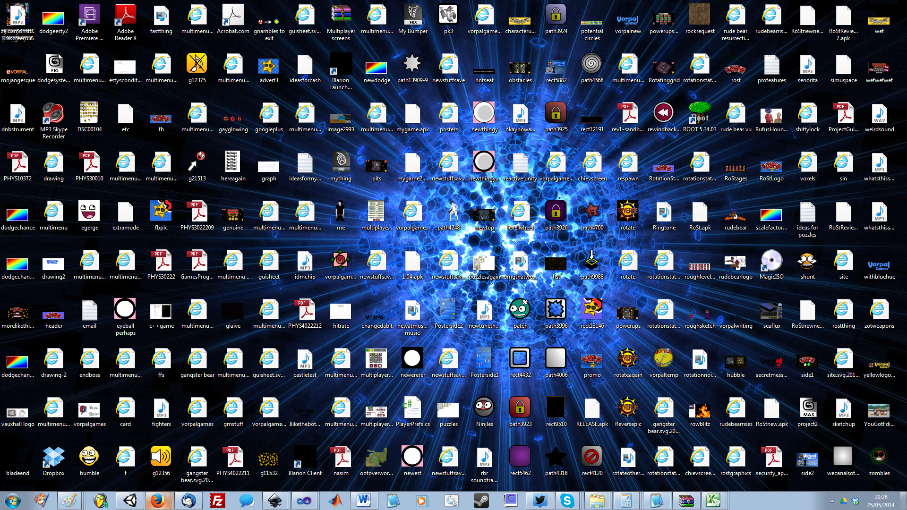
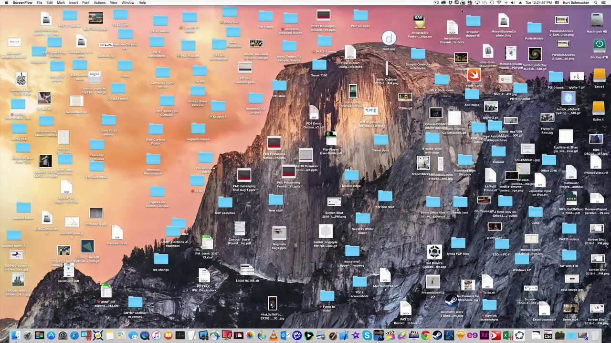

Organizacja pracy
=================





```
Praca \

Praca \ 2021-01-01 \ ...
Praca \ 2021-03-14 \ ...

Projekt \ Zajęcia \ Program1 \ ...
Projekt \ Zajęcia \ Program2 \ ...

Warsztat \

Warsztat \ Coś \ ...
Warsztat \ Inne \ ...
Warsztat \ Klon \ ...
```


```
WORK \ 2021-01 \
WORK \ 2021-01 \

PROJECT \ CLONE \
PROJECT \ PRIVATE \

LOG \ IIS \
LOG \ SERVICE \

SDK\java
SDK\eclipse
```


Narzędzia
---------

| Nazwa              | Kategoria               | Link                                        |
| ------------------ | ----------------------- | ------------------------------------------- |
| Git                | System kontroli wersji  | https://git-scm.com/downloads/              |
| TortoiseGit        | System kontroli wersji  | https://tortoisegit.org/download/           |
| 7-zip              | Archiwizer              | https://www.7-zip.org/download.html         |
| PeaZip             | Archiwizer              | https://peazip.github.io/                   |
| Eclipse            | Środowisko zintegrowane | https://www.eclipse.org/downloads/          |
| NetBeans           | Środowisko zintegrowane | https://netbeans.apache.org/download/       |
| IntelliJ IDEA      | Środowisko zintegrowane | https://www.jetbrains.com/idea/download/    |
| Visual Studio Code | Edytor kodu             | https://code.visualstudio.com/download/     |
| Atom               | Edytor kodu             | https://atom.io/                            |
| Frhed              | Edytor heksadecymalny   | https://sourceforge.net/projects/frhed/     |
| Hexplorer          | Edytor heksadecymalny   | https://sourceforge.net/projects/hexplorer/ |
