Tworzenie projektu
==================

Eclipse
-------

### Nowy projekt

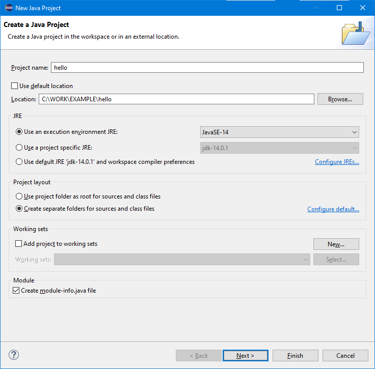

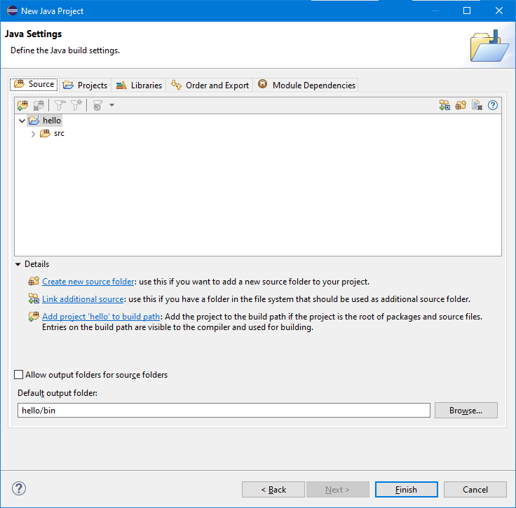

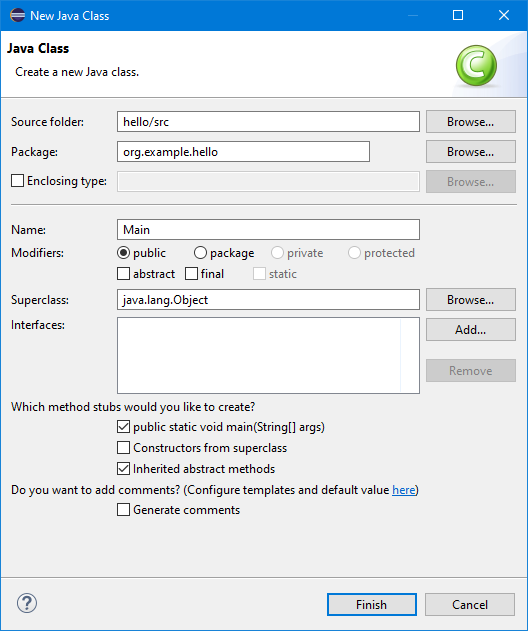

### Widok projektu

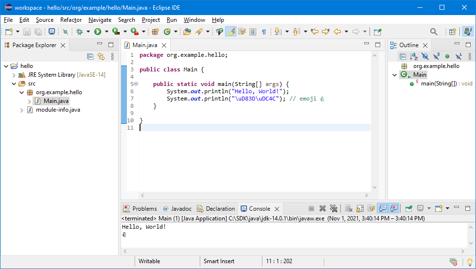

### Import projektu

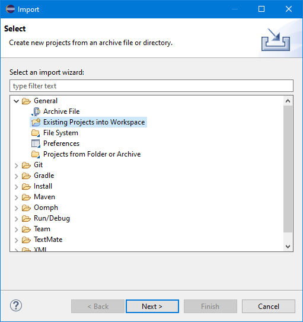

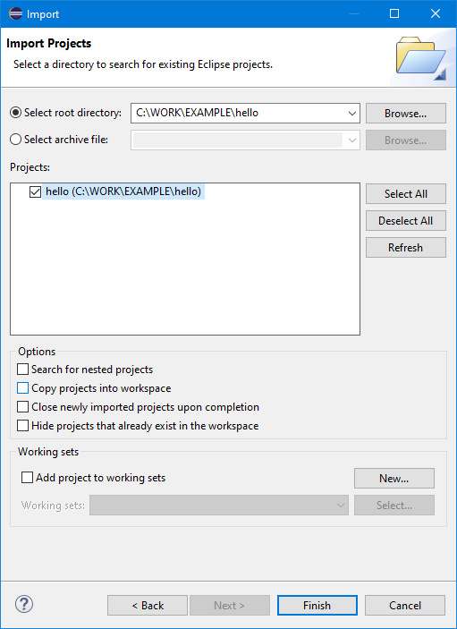

### Sprawdzanie pisowni

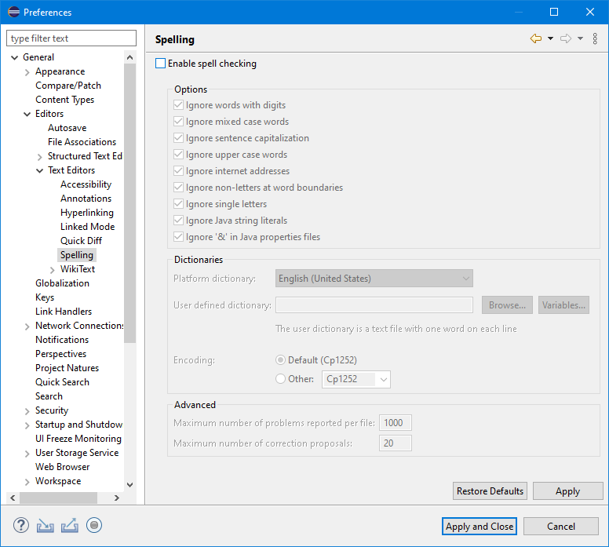

---

NetBeans
--------

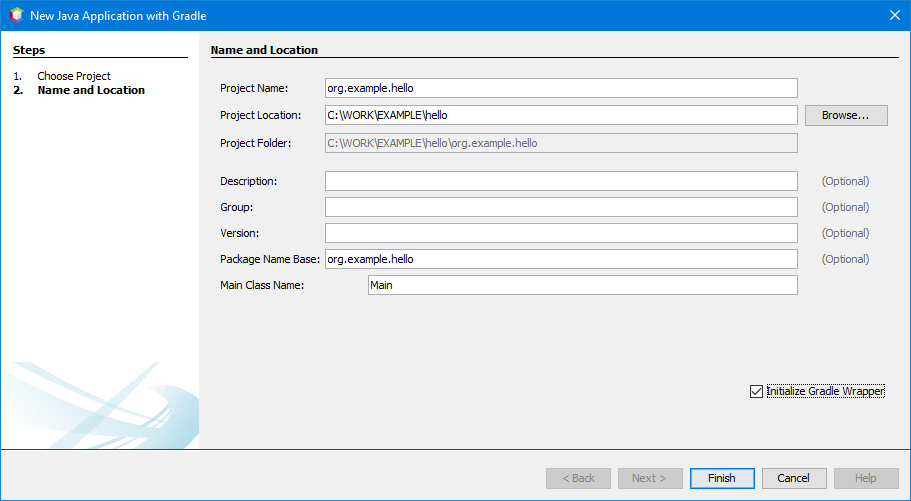

### Widok projektu

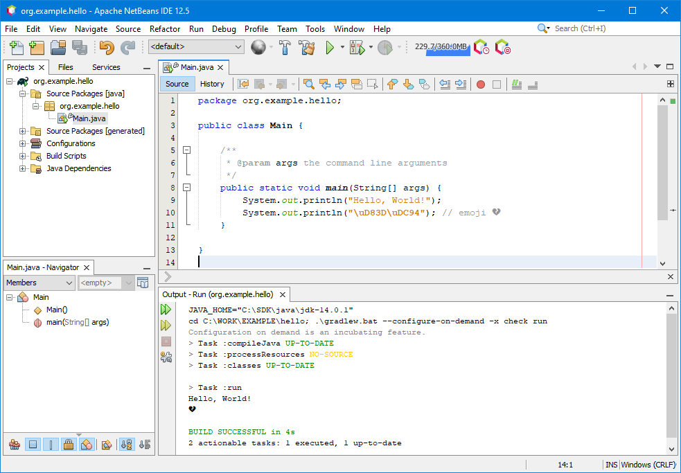

### Import projektu

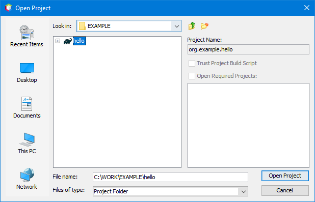

### Wskazanie JDK podczas instalacji

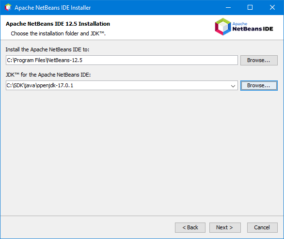

### Aktywacja wymaganych funkcji


### Automatyczne rozwiązywanie problemów z projektem

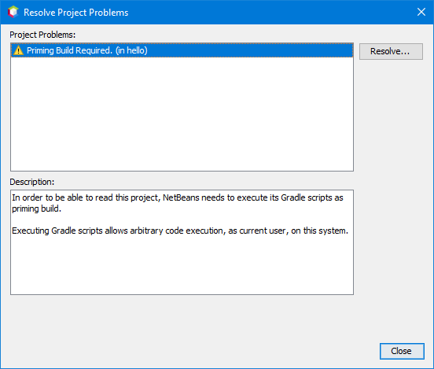

### Zmiana JDK używanego przez NetBeans

Lokalizację JDK podaje się w kluczu ``netbeans_jdkhome`` w pliku konfiguracyjnym ``netbeans.conf``.

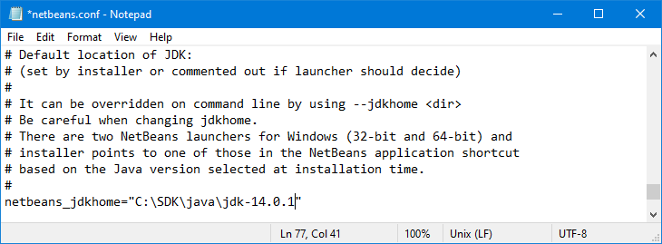

### Poprawna obsługa Unikodu

W pliku konfiguracyjnym ``netbeans.conf`` należy dodać poniższą opcję w kluczu konfiguracyjnym ``netbeans_default_options``.

```
-J-Dfile.encoding=UTF-8
```

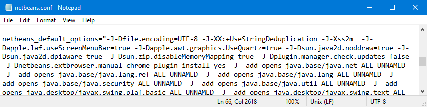

---

IntelliJ IDEA
-------------

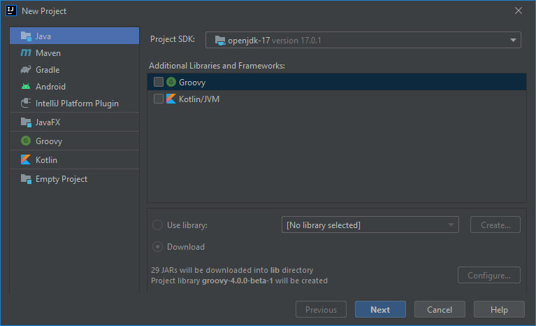

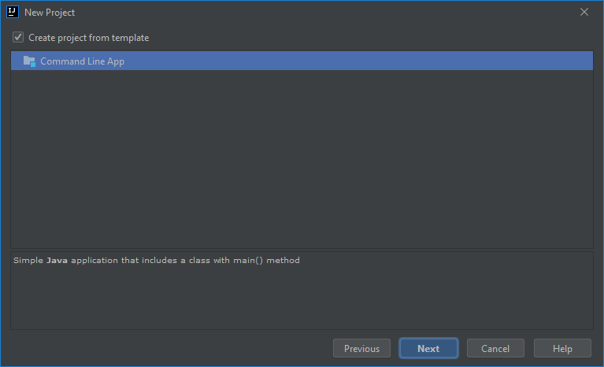


### Widok projektu

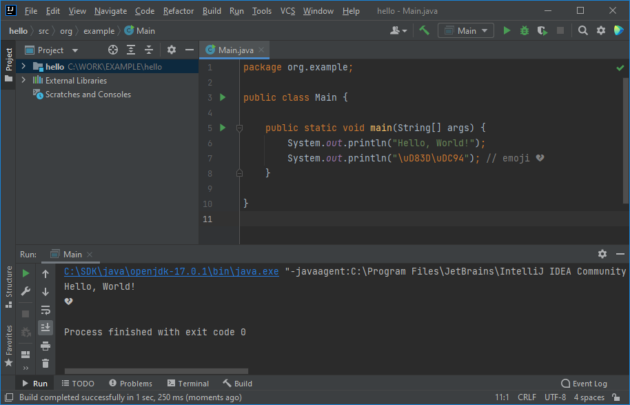

### Import projektu

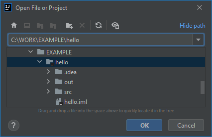

### Wyłączenie agenta podczas debugowania

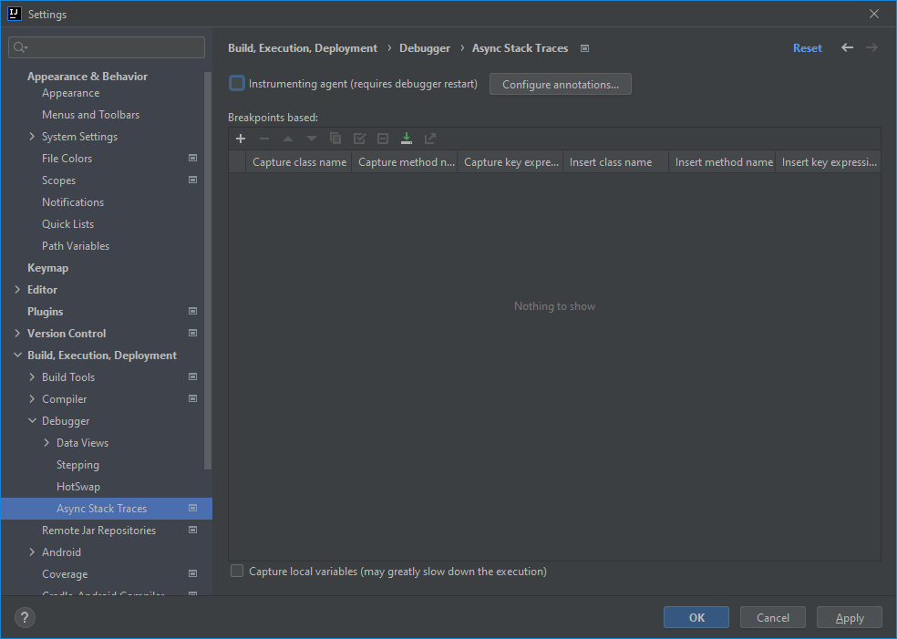
