# IntelliJ IDEA

## Nowy projekt

W środowisku **IntelliJ IDEA** projekt jest zbiorem modułów. Tworząc nowy projekt, kreator utworzy domyślnie moduł o takiej samej nazwie jak projekt i przypisze katalog projektu jako główny katalog modułu. Jest to wygodne i adekwatne jedynie dla prostych rozwiązań, składających się faktycznie tylko z jednego modułu. W praktyce, lepiej od początku rozważyć układ wielu modułów. Często bowiem oprócz głównego modułu aplikacji przydadzą się dodatkowe moduły testowe i biblioteczne.

Jako nazwę pakietu można wybrać nazwę składającą się z przykładowego prefiksu ``org.example``, ``com.company`` lub nazwy użytkownika ``jkowalski``.

Przykłady nazw pakietów ``org.example.project``, ``com.company.project``, ``jkowalski.project``.

Aby utworzyć wielomodułowy projekt w środowisku **IntelliJ IDEA** należy zacząć od stworzenia projektu, a następnie zdefiniować w nim moduł główny i usunąć moduł utworzony przez kreatora.


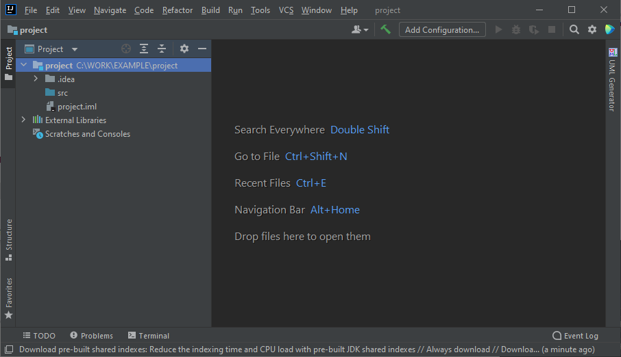

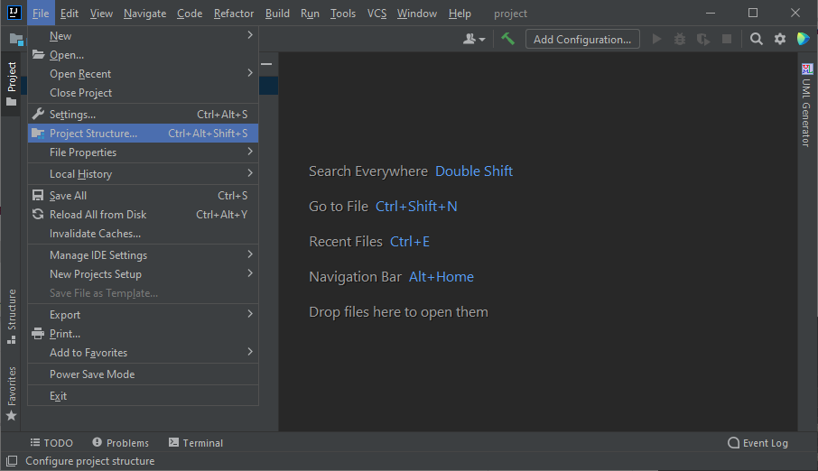

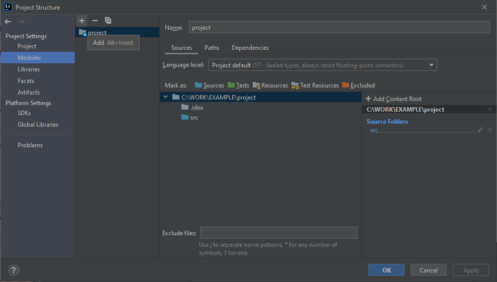

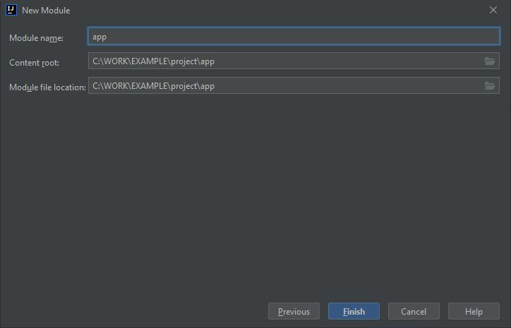

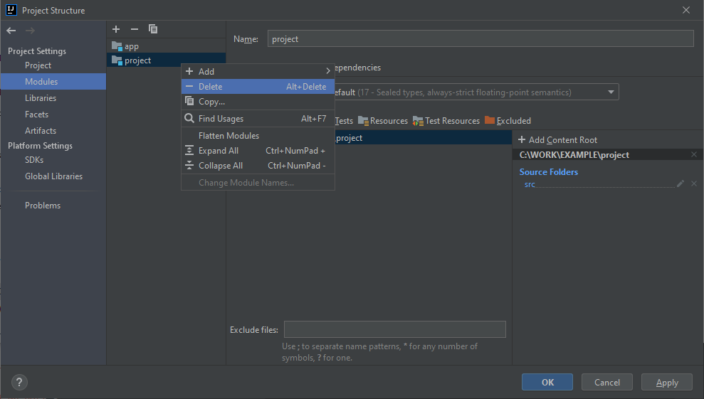

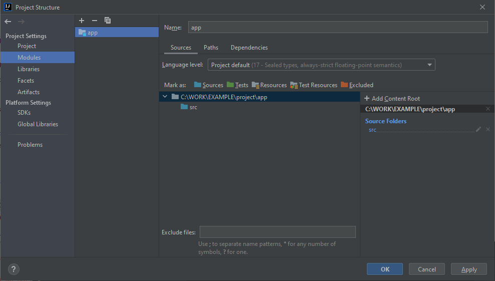

Katalog ``src`` utworzony w katalogu głównym projektu należy usunąć ręcznie, nie będzie on używany w tym przypadku.

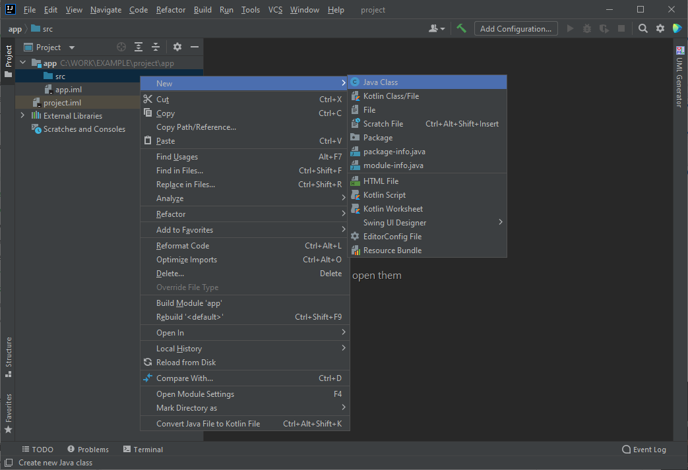

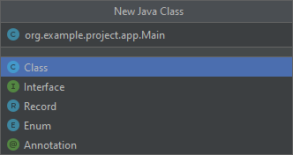

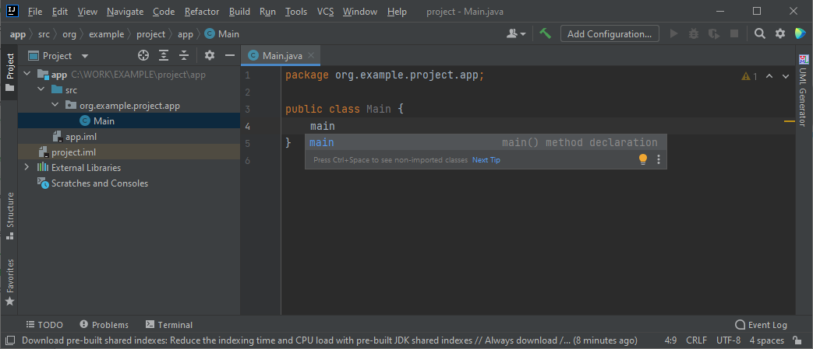


Tak utworzony projekt będzie składał się z następujących plików i katalogów w katalogu projektu.

```
app
app \ src
app \ src \ org \ example \ project \ app \ Main.java
```

Alternatywnie można pozostawić katalog ``src`` jako główny katalog źródeł i wskazywać w poszczególnych modułach lokalizację dla głównego katalogu wewnątrz tego katalogu.

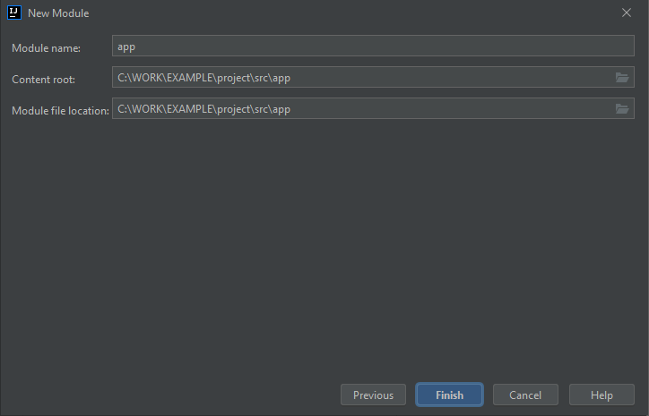


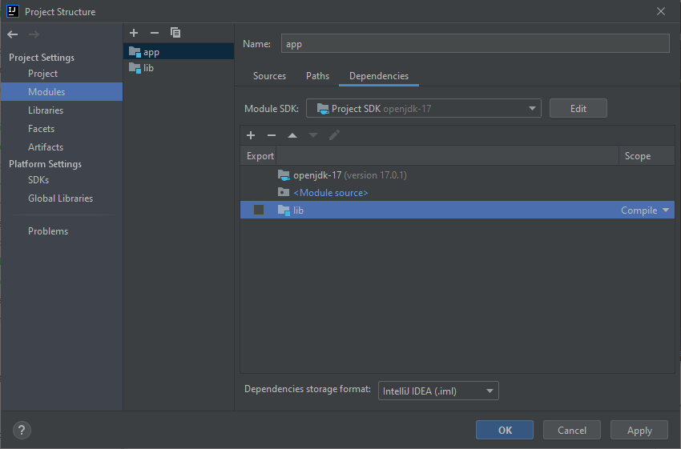

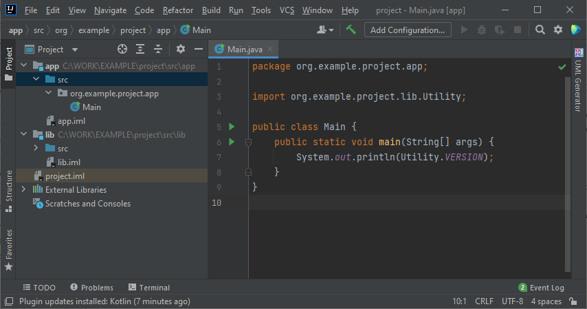

W takim wypadku układ katalogów będzie wyglądał następująco.

```
src
src \ app
src \ app \ src
src \ app \ src \ org \ example \ project \ app \ Main.java
src \ lib
src \ lib \ src
src \ lib \ src \ org \ example \ project \ lib \ Utility.java
```

## Widok główny

Na najwyższym poziomie jest **projekt**, w którym znajduje się co najmniej jeden **moduł** zawierający jeden lub więcej pakietów Javy.

Do ustawień budowania gotowego archiwum zawierającego część uruchomieniową służą przypisane do projektu **artefakty**.

## Na poziomie **projektu**

 - Wybór SDK

 - Biblioteki zewnętrzne

## Na poziomie **modułu**

 - Zależności biblioteczne

## Na poziomie **artefaktu**

## Operacje menu

| Operacja           | Menu                             |
| ------------------ | -------------------------------- |
| Struktura projektu | ``File`` > ``Project structure`` |
| Zamykanie projektu | ``File`` > ``Close project``     |

## Parametry uruchomienia

Opcjonalnie do programu podczas uruchomienia mogą zostać  przekazane parametry uruchomienia. Należy je ustawić w konfiguracji uruchomienia / odpluskwiania.

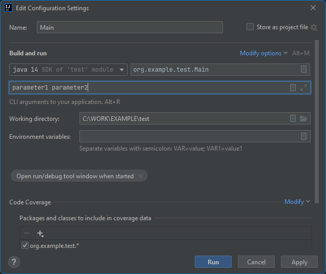

## Platforma **JDK**

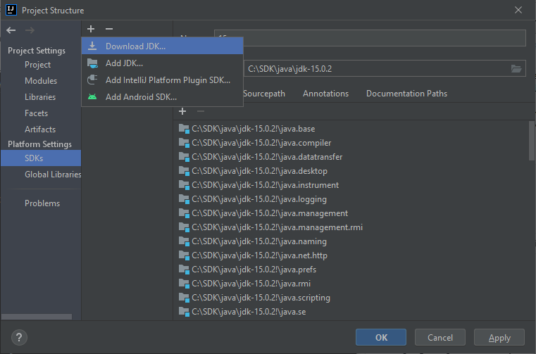


## Skróty klawiszowe edytora

### Ctrl + Q

Wyświetlanie dodakowej informacji w formie podpowiedzi lub zadokowanego okna dokumentacji.
Wielokrotne naciśnięcie przełącza tryb wyświetlania informacji.


### Ctrl + B

Przejście do definicji lub sekcji importującej.

### Ctrl + Alt + L

Formatowanie kodu. Odpowiednik opcji menu ``Code`` > ``Reformat code``.

## Generowanie kodu

### Pętle iteracyjne


``itar``

``iter``

## Dodawanie zależności


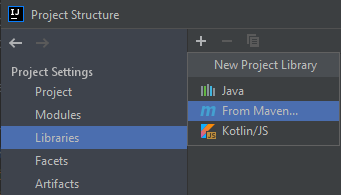


