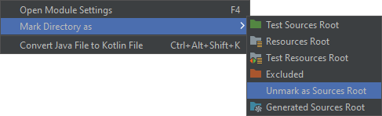
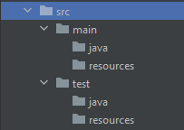
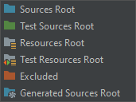
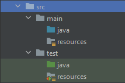

Konwencje
=========

Konwencje nazewnicze
--------------------

Nazwy pakietów są zapisywane przy użyciu małych liter, cyfr oraz znaku podkreślenia.

Nazwy pakietów zwykle odpowiadają odwróconej nazwie domeny internetowej.
Jeśli człon zaczyna się od cyfry, powinien być poprzedzony znakiem podkreślenia.
Znak minus, dozwolony w domenie internetowej, również zamieniany jest na znak podkreślenia.
Jeśli człon jest zarezerwowanym słowem języka, dodaje się na końcu znak podkreślenia.

Dla przykładu, dla domeny ``int.123.my-company.org`` odpowiadająca jej nazwa pakietu to ``org.my_company._123.int_``.

Przykładowe "testowe" nazwy pakietów to ``org.example``, ``com.example``, ``com.company`` do których dodajemy człon nazwy projektu.

```java
package org.example.first;
```

Nazwy klas zapisywane są w notacji **PascalCase** nazywanej też **TitleCase**.

```java
public class MyClass {
}
```

Nazwy metod oraz zmiennych zapisywane są w notacji **camelCase**.

```java
public void storeMemory() {
  int myNumber = 1;
}
```

Nazwy zmiennych powinny w krótki sposób opisywać do czego służą.

Jednoliterowe zmienne powinny być raczej unikane, o ile nie są to zmienne tymczasowe.

Zwyczajowo stosuje się zmienne tymczasowe ``i``, ``j``, ``k``, ``m``, ``n`` dla typu ``int``, ``c`` dla typu ``char``, ``b`` dla ``boolean``, ``s``, ``t`` dla ``String``.

Popularną konwencją jest rozpoczynanie nazw prywatnych pól klasy literą ``m`` (od "member").

```java
private int mMyField;
```

Alternatywnie można poprzedzić nazwę takiego pola znakiem podkreślenia.

```java
private int _MyField;
```

Nazwa klasy abstrakcyjnej bywa poprzedzona słowem ``Abstract`` lub ``Base``.

```java
public abstract class AbstractClassName {
    public void go() {
        System.out.println("AbstractClassName.go()");
    }
}

public class ClassName extends AbstractClassName {
}

public class Main {

    public static void main(String[] args) {
        var o = new ClassName();
        o.go();
    }

}
```

Nazwy interfejsów są zwykłymi nazwami, ale przyjęte jest stosowanie formy przymiotnika.
Zdarza się zatem, że dodaje się do nich końcówkę ``able``, np. ``Iterable``, ``Consumable``, ``Bookable``, choć w bibliotece standardowej znajdują się interfejsy o nazwach ``List``, ``Collection``, w odróżnieniu od konwencji znanej z języka ``C#``, gdzie nazwy interfejsów są poprzedzone literą ``I``, np. ``IList``.

Komentarze
----------

Klasy oraz publiczne metody powinny być opatrzone poprawnym komentarzem **Javadoc**.

Szczególnie przydatne jest umieszczenie informacji o możliwych wyjątkach.

```java
/**
 * Perform test.
 *
 * @param o    Anything
 * @param text Something
 *             more...
 * @return Number
 * @throws ArithmeticException
 */
public int test(Object o, String text) {
    throw new ArithmeticException(); // throw exception
}
```

Formatowanie dokumentu
----------------------

Klamra otwierająca definicję klasy umieszczana jest w tej samej lini.

Dopuszczone są jedna lub dwie puste linie oddzielające segment definicji wewnątrz klas.

Fragmenty kodu źródłowego można grupować w regiony.  

```java
//region nazwa regionu

//endregion
```

Przykładowy kod
---------------

```java
package org.example.first;

/**
 * Calculator class description
 */
public class Calculator {

    //region constants

    final double MEMORY_ZERO = 0;

    //endregion

    //region variables

    private double mMemory;

    //endregion

    //region properties

    private boolean mActive;

    /**
     * Get value of active flag.
     *
     * @return Active flag
     */
    public boolean isActive() {
        return mActive;
    }

    /**
     * Set value for active flag.
     *
     * @param active Active flag
     */
    public void setActive(boolean active) {
        mActive = active;
    }

    private double mValue;

    /**
     * Get value.
     *
     * @return Value
     */
    public double getValue() {
        return mValue;
    }

    /**
     * Set value.
     *
     * @param value Value
     */
    public void setValue(double value) {
        mValue = value;
    }

    //endregion

    //region storeMemory

    /**
     * Store value in memory.
     *
     * @since 2021-01
     */
    public void storeMemory() {
        mMemory = mValue;
    }

    //endregion

    //region storeMemory

    /**
     * Restore value from memory.
     */
    public void restoreMemory() {
        mValue = mMemory;
    }

    //endregion

    //region clearMemory

    /**
     * Clear memory.
     */
    public void clearMemory() {
        this.mMemory = MEMORY_ZERO;
    }

    //endregion

}
```

Konwencje projektowe
--------------------

Standardowa struktura katalogów (Standard Directory Layout).

https://maven.apache.org/guides/introduction/introduction-to-the-standard-directory-layout.html

Kod źródłowy powinien znajdować się w katalogu ``src``.

Pliki źródłowe programu umieszczane są w katalogu ``src/main/java``.

Pliki źródłowe testów umieszczane są w katalogu ``src/test/java``.

Źródła grupujemy w pakietach, a te w podkatalogach , tzn. dla pakietu ``org.example.first`` powinna być to ścieżka ``org/example/first``.

Przykładowy plik startowy aplikacji zawierający statyczną funkcję ``main`` powinien znaleźć się w katalogu ``src/main/java/org/example/first/Main.java``.

Katalog kompilacji to ``build``.

Katalog pakietów wynikowych to ``out``.

W najprostszym przypadku projekt może składać się tylko z jednego modułu.
Domyślnie po utworzeniu nowego projektu IDE tworzy automatycznie moduł o takiej samej nazwie, tworzy katalog ``src`` i ustawia go jako katalog źródeł. Aby dostosować tę strukturę do wyżej opisanej konwencji, należy wykonać następujące operacje.

Na poziomie katalogu ``src`` należy odznaczyć ten katalog aby nie był traktowany jako katalog źródeł.



Następnie należy utworzyć brakujące katalogi dla źródeł programu, zasobów oraz opcjonalnie testów, tzn. ``src\main\java``, ``src\main\resources`` oraz ``src\test\java`` i ``src\test\resources``.



Następnie katalogi te należy zaznaczyć odpowiednio jako:

- katalog źródeł ``src\main\java`` jako **Sources Root**,
- katalog zasobów ``src\main\resources`` jako **Resources Root**
- katalog źródeł testów ``src\test\java`` jako **Test Sources Root**,
- katalog zasobów testów ``src\test\resources`` jako **Test Resources Root**



Tak zaznaczone katalogi będą teraz pełniły określoną funkcjonalność, a środowisko programistyczne będzie odpowiednio z nich korzystać.



Dla większych projektów zawierających biblioteki lub kilka różnych programów można zdecydować się na modularyzację.

W takim wypadku poszczególne moduły umieszczamy w oddzielnych katalogach na poziomie katalogu projektu. Dla każdego z katalogów powtarza się wyżej opisana struktura katalogów.

```
project \ common-library
project \ common-library \ src \ main \ java \ ...
project \ common-library \ src \ test \ java \ ...

project \ command-utility
project \ command-utility \ src \ main \ java \ ...
project \ command-utility \ src \ test \ java \ ...

project \ desktop-app
project \ desktop-app \ src \ main \ java \ ...
project \ desktop-app \ src \ test \ java \ ...
```
