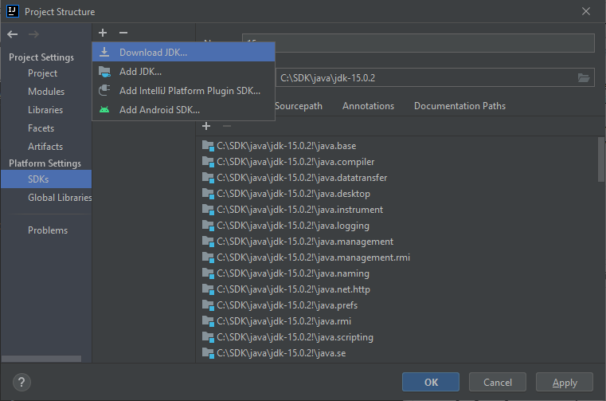

# IntelliJ IDEA

Na najwyższym poziomie jest **projekt**, w którym znajduje się co najmniej jeden **moduł** zawierający jeden lub więcej pakietów Javy.

Do ustawień budowania gotowego archiwum zawierającego część uruchomieniową służą przypisane do projektu **artefakty**.

## Na poziomie **projektu**

- Wybór SDK


## Na poziomie **modułu**

## Na poziomie **artefaktu**

## Operacje menu

```
+--------------------+----------------------------------+
| Zamykanie projektu | ``File`` > ``Close project``     |
+--------------------+----------------------------------+
| Struktura projektu | ``File`` > ``Project structure`` |
+--------------------+----------------------------------+
```

## Struktura projektu

## Platforma **JDK**




