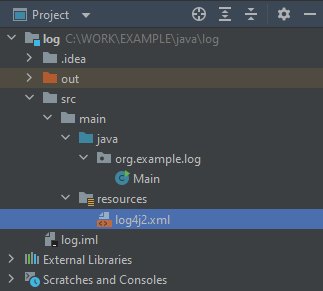

# Dziennik aplikacji

# Logging API

Wbudowany w środowisko ``Java`` mechanizm tworzenia wpisów dziennika aplikacji.

Mechanizm znajduje się w pakiecie ``java.util.logging``.
Funkcjonalność dziennika udostępnia klasa ``Logger``.

```java
import java.util.logging.Logger;

public class Main {
    private final static Logger LOGGER = Logger.getLogger(Main.class.getName());

    public static void main(String[] args) {
        LOGGER.info("Hello, World.");
    }
}
```

Obiekt klasy ``Logger`` utworzony metodą ``getLogger`` udostępnia funkcjonalność tworzenia wpisów dziennika przy pomocy metody ``log``,
która wymaga podania poziomu ważności (severity) oraz treści wpisu oraz krótszych funkcji ``warning``, ``severe``, ``info``, ``fine`` wymagających
podania jedynie treści wpisu.

```java
LOGGER.log(Level.WARNING, "This is warning");
```

Domyślny logger wypisuje komunikaty bezpośrednio na wyjście konsoli.

Możliwe jest przekierowanie wpisów do pliku bądź wyłączenie wyjścia konsoli.

```java
import java.io.IOException;
import java.util.logging.FileHandler;
import java.util.logging.Level;
import java.util.logging.Logger;

public class Main {
    private final static Logger LOGGER = Logger.getLogger(Main.class.getName());

    public static void main(String[] args) {
        try {
            FileHandler fh = new FileHandler("C:\\WORK\\EXAMPLE\\log.txt");
            LOGGER.addHandler(fh);
            LOGGER.setUseParentHandlers(false);
        } catch (IOException e) {
            e.printStackTrace();
        }
        LOGGER.log(Level.WARNING, "This warning will be written to file or console if file is inaccessible");
    }
}
```

Taki plik będzie miał domyślnie format **XML**.

```xml
<?xml version="1.0" encoding="UTF-8" standalone="no"?>
<!DOCTYPE log SYSTEM "logger.dtd">
<log>
<record>
  <date>2022-02-15T12:37:49</date>
  <millis>1644925069632</millis>
  <sequence>0</sequence>
  <logger>org.example.log.Main</logger>
  <level>WARNING</level>
  <class>org.example.log.Main</class>
  <method>main</method>
  <thread>1</thread>
  <message>This warning will be written to file or console if file is inaccessible</message>
</record>
</log>
```

Aby zmienić postać w jakiej prezentowany będzie wpis dziennika, należy utworzyć klasę dziedziczącą po klasie abstrakcyjnej ``Formatter`` z własną implementacją metody ``format`` jak w poniższym przykładzie.

```java
import java.io.IOException;
import java.time.Instant;
import java.time.LocalDateTime;
import java.time.ZoneId;
import java.time.format.DateTimeFormatter;
import java.util.logging.*;

public class Main {
    private final static Logger LOGGER = Logger.getLogger(Main.class.getName());

    public static void main(String[] args) {
        try {
            FileHandler fh = new FileHandler("C:\\WORK\\EXAMPLE\\log.txt", true);
            fh.setFormatter(new CustomFormatter());
            LOGGER.addHandler(fh);
            LOGGER.setUseParentHandlers(false);
        } catch (IOException e) {
            e.printStackTrace();
        }
        LOGGER.log(Level.WARNING, "This warning will be written to file or console if file is inaccessible");
    }

    private static class CustomFormatter extends Formatter {
        @Override
        public String format(LogRecord record) {
            DateTimeFormatter formatter = DateTimeFormatter.ofPattern("yyyy-MM-dd HH:mm:ss.SSS");
            Instant instant = Instant.ofEpochMilli(record.getMillis());
            LocalDateTime time = LocalDateTime.ofInstant(instant, ZoneId.systemDefault());
            StringBuffer sb = new StringBuffer();
            sb.append(formatter.format(time));
            sb.append(" ");
            sb.append(String.format("[ %-7s ] ", record.getLevel().toString()));
            sb.append(record.getMessage());
            sb.append(System.lineSeparator());
            return sb.toString();
        }
    }
}
```

```
2022-02-15 12:50:28.317 [ WARNING ] This warning will be written to file or console if file is inaccessible
```

Można nadpisać poziom ważności komunikatu, aby np. wyłączyć logowanie w ogóle.

```java
LOGGER.setLevel(Level.OFF);
```

# Log4j

Mechanizm logowania znacznie bardziej rozbudowany w stosunku do wbudowanego ``Java Logger API``.

https://logging.apache.org/log4j/2.x/manual/index.html

Podobnie jednak jak w przypadku mechanizmu wbudowanego, logowanie odbywa się poprzez obiekt klasy ``Logger``,
z tą różnicą, że klasa ``Logger`` z biblioteki ``Log4j`` jest zdefiniowana w pakiecie ``org.apache.logging.log4j``.

Aby dodać ``Log4j`` do projektu należy dodać biblioteki ``org.apache.logging.log4j:log4j-api`` oraz ``org.apache.logging.log4j:log4j-core``.


```java
import org.apache.logging.log4j.Level;
import org.apache.logging.log4j.LogManager;
import org.apache.logging.log4j.Logger;

public class Main {
    private final static Logger LOGGER = LogManager.getLogger(Main.class.getName());

    public static void main(String[] args) {
        LOGGER.trace("Configuration File Defined To Be :: "+System.getProperty("log4j.configurationFile"));
        LOGGER.log(Level.WARN, "Warning");
        LOGGER.log(Level.INFO, "Information");
        LOGGER.log(Level.ERROR, "Error");
    }
}
```

### Uwaga

Z powodu błędów i podatności w zakresie bezpieczeństwa w ``Log4j`` w wersji **1.x** nie należy używać tych wersji biblioteki.  

https://logging.apache.org/log4j/1.2/

Konfiguracja mechanizmu dziennika oraz możliwych "wyjść" odbywa się poprzez plik konfiguracyjny ``log4j2.xml``,
dzięki czemu zmiana sposobu logowania zdarzeń aplikacji może być wykonana bez konieczności rekompilacji programu.

```xml
<?xml version="1.0" encoding="UTF-8"?>
<Configuration>
    <Appenders>
        <Console name="Console" target="SYSTEM_OUT">
            <PatternLayout pattern="%d{HH:mm:ss.SSS} [%t] %-5level %logger{36} -- %msg%n"/>
        </Console>
    </Appenders>
    <Loggers>
        <Logger name="com.example.log" level="INFO">
            <AppenderRef ref="Console"/>
        </Logger>
        <Root level="info">
            <AppenderRef ref="Console"/>
        </Root>
    </Loggers>
</Configuration>
```

Plik należy umieścić w katalogu zasobów projektu.


