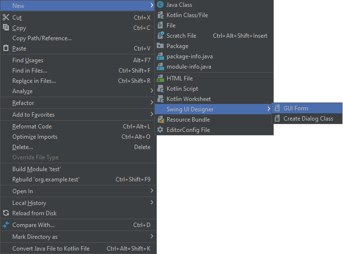
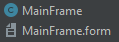
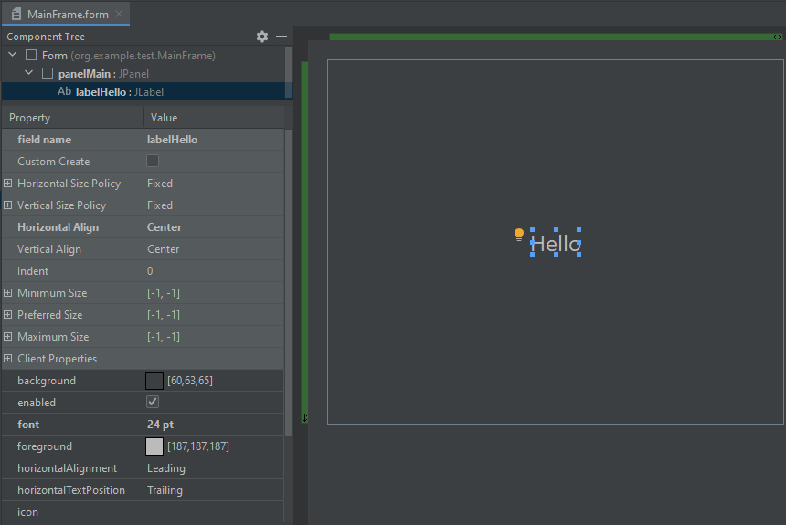
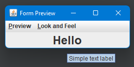

Interfejs użytkownika
=====================

JFC
---

``JFC`` to skrót od ``Java Foundation Classess``. Jest to framework, który zawiera zbiór funkcjonalności służących do budowania graficznego interfejsu użytkownika w aplikacjach. Jest częścią ``SDK``.

AWT
---

``AWT``, którego nazwa to skrót od *Abstract Window Toolkit* to najstarsza biblioteka służąca do tworzenia graficznego interfejsu użytkownika. Komponenty w tej bibliotece są zależne od platformy, zaś implementacja jest "ciężka", ze względu na użycie "pod spodem" natywnych elementów systemu operacyjnego. Jest częścią ``JDK``. Klasy ``AWT`` znajdują się w pakiecie **java.awt**.

W praktyce nie używa się komponentów wizualnych tej biblioteki w programach ``Java``, na rzecz biblioteki ``Swing``.

Chociaż większość klas ``AWT`` została zastąpiona klasami biblioteki ``Swing``, część funkcjonalności pozostała w bibliotece ``AWT``, np. ``setMinimumSize``. Również klasy obsługi zdarzeń pozostają częścią ``AWT``.

Swing
-----

``Swing`` jest biblioteką komponentów interfejsu użytkownika. Jest częścią ``JDK``. Zastępuje ona ``AWT`` i zawiera implementacje komponentów niezależnych od platformy, co umożliwia tworzenie graficznego interfejsu użytkownika, który będzie działał w różnych systemach operacyjnych jednakowo. Klasy ``Swing`` znajdują się w pakiecie **javax.swing**.

Kod źródłowy klasy korzystający z biblioteki ``Swing`` zwykle importuje przestrzeń nazw w poniższy sposób.

```java
import javax.swing.*;
```

Okna
----

W bibliotece ``Swing`` zarówno okno aplikacji jak i dialogowe jest tzw. kontenerem nawyższego poziomu.

https://docs.oracle.com/javase/tutorial/uiswing/components/toplevel.html

Klasą reprezentującą okno aplikacji jest ``JFrame``. W przypadku okna dialogowego taką klasą jest ``JDialog``.

Klasa opisująca okno aplikacji dziedziczy po klasie kontenera najwyższego poziomu.

W klasie kontenera najwyższego poziomu znajdują się dwa obiekty: obiekt zawartości okna, tzw. **Content Pane** oraz obiekt reprezentujący menu aplikacji, tzw. **Menu Bar**. Należy co najmniej wskazać odpowiedni komponent reprezentujący obiekt zawartości.

Komponenty
----------

Komponenty to elementy z których składa się graficzny interfejs użytkownika.
Do dyspozycji jest szereg podstawowych elementów takich jak panele, pola tekstowe, nowe mogą być zdefiniowane przez programistę. Komponenty dziedziczą po klasie ``JComponent`` i układane są przez mechanizm menadżera układu (layout manager) zazwyczaj w modelu pudełkowym.

| Klasa        | Opis                                              | Kontener |
| ------------ | ------------------------------------------------- | :------: |
| JPanel       | Panel                                             | X        |
| JScrollPane  | Panel zawierający paski przewijania               | X        |
| JLabel       | Etykietka tekstowa (może być obrazkiem)           |          |
| JButton      | Przycisk                                          |          |
| JCheckBox    | Pole zaznaczenia wyboru (pole typu check)         |          |
| JRadioButton | Wybór jednego z wielu elementów (pole typu radio) |          |
| JTextField   | Pole tekstowe                                     |          |
| JTextArea    | Obszar tekstowy                                   |          |
| HSpacer      | Odstęp poziomy                                    |          |
| VSpacer      | Odstęp pionowy                                    |          |

Konwencje nazewnicze
--------------------

Nazwy klas okien, które dziedziczą po ``JFrame`` dla odróżnienia od innych klas mogą się kończyć nazwą **Frame**. Klasa okna głównego aplikacji można więc nazwać **MainFrame**. Analogicznie nazwy klas okien dialogowych mogą się kończyć nazwą **Dialog**.

Komponenty można nazywać w dowolny sposób, ale warto przyjąć konsekwentnie jeden sposób. Dobrym pomysłem może być prefiksowanie lub sufiksowanie nazw komponentów nazwą pochodzącą od rodzaju komponentu, np. **panelFirst**, **buttonFirst** lub **firstPanel**, **firstButton**, itd.

Tworzenie klasy okna
--------------------




Po tej operacji zostaną utworzone dwa pliki. Plik kodu źródłowego, gdzie znajdą się definicje komponentów, obsługa zdarzeń, oraz tak zwana logika okna oraz plik z rozszerzeniem **.form** zawierający definicję okna.



Kod źródłowy początkowo nie zawiera niczego, więc trzeba go zmodyfikować. Pierwszą rzeczą jest ustawienie dziedziczenia klasy po ``JFrame``.

```java
package org.example.test;

import javax.swing.*;

public class MainFrame extends JFrame {
}
```

Nowo utworzone okno zawiera jeden komponent klasy ``JPanel``. Nadaje się on do użycia jako obiekt zawartości.

Aby jednak było możliwe odwołanie się do obiektu reprezentującego komponent, należy go nazwać. Nie jest konieczne nadawanie nazw wszystkim komponentom. Natomiast należy je nadać wszystkim do których ma być możliwy dostęp z kodu źródłowego obsługi okna.


Po przejściu do kodu źrodłowego można zauważyć, że automatycznie pojawi się odpowiednia definicja pola w klasie.

```java
public class MainFrame extends JFrame {
    private JPanel panelMain;
}
```

Ponieważ klasa ``JPanel`` reprezentuje pusty kontener, tak utworzone okno nie będzie zawierać niczego. Na początek można więc dodać pole etykiety tekstowej.



Przy okazji można też ustawić kilka właściwości takich jak **text**, czy **font**.


Wybierając z menu kontekstowego opcję **Preview** można wyświetlić podgląd tak zdefiniowanego okna.



Na tym etapie można dokończyć podstawową edycję pliku klasy okna, dodając konstruktor, w którym powinno znaleźć się odwołanie do konstruktora klasy bazowej oraz określenie obiektu zawartości. Należy także wywołać metodę **pack()**, aby automatycznie ustawić rozmiary dla wszystkich komponentów składowych.

```java
public class MainFrame extends JFrame {
    private JPanel panelMain;
    private JLabel labelHello;

    public MainFrame() {
        super("App");
        this.setContentPane(panelMain);
        this.pack();
    }
}
```

Tak zdefiniowany konstruktor zawiera minimalną ilość kodu konieczną do użycia klasy aby utworzyć okno aplikacji.

```java
import javax.swing.*;

public class Main {
    public static void main(String[] args) {
        var frame = new MainFrame();
        frame.setDefaultCloseOperation(JFrame.EXIT_ON_CLOSE);
        frame.setVisible(true);
    }
}
```

Po uruchomieniu programu, pojawi się okno aplikacji.

Metody klasy komponentu
-----------------------

```setPrefferedSize```

Określa oczekiwany rozmiar komponentu.

```setComponentListener```

Określa obiekt "nasłuchujący" zdarzeń takich jak zmiana widoczności, rozmiaru oraz położenia komponentu.

```requestFocusInWindow```

Metoda komponentu umożliwiająca przeniesienie fokusu na komponent, który po tym stanie się aktywny. Może być przydatna w celu określenia, który komponent ma być aktywny po wyświetleniu okna. W takim wypadku należy pamiętać, że powinna być ona wykonana po metodzie ``pack``. Istnieje również alternatywna metoda ``grabFocus``, nie zaleca się jej użycia, gdyż jej przeznaczeniem jest przeniesienie aktywności wraz z aktywacją okna, nawet jeśli jest ono nieaktywne.

Metody klasy okna
-----------------

```setVisible```

Ustawia widoczność okna. Należy użyć tej metody aby wyświetlić okno.

Niewidoczne okno wciąż zajmuje zasoby komputera, ale ponowne wyświetlenie go jest szybkie.

```setTitle```

Określa nazwę okna.

```setDefaultCloseOperation```

Pozwala na określenie domyślnej akcji zamknięcia okna. Najczęściej używanymi wartościami są ``JFrame.EXIT_ON_CLOSE`` dla głównego okna aplikacji oraz ``JFrame.HIDE_ON_CLOSE`` dla okien narzędziowych.

```setSize```

Określa rozmiar okna, przy czym zmiana rozmiaru następuje po "upakowaniu", więc aby określić początkowy rozmiar, należy użyć tej metody już po utworzeniu układu okna lub użyć metody ``setPrefferedSize``.

```setMinimumSize```

Określa minimalny rozmiar okna.

```setLocationRelativeTo```

Określa pozycję okna względem innego komponentu. Można użyć wartości ``null`` aby okno było wypozycjonowane względem środka ekranu. Metodę tę należy wywoływać już po wywołaniu metody ``pack`` po wcześniejszym ustaleniu rozmiaru okna, czyli wywołaniu metody ``setSize``.

```setJMenuBar```

Ustawia komponent menu programu, który należy wcześniej utworzyć.

```dispose```

Zwalnia zasoby używane przez okno oraz jego komponenty, okno staje się niedostępne i jeśli jest to ostatnie okno programu lub określona jest domyślna akcja zamknięcia na wyjście z programu, program kończy swoje działanie.

Programowe tworzenie okien
--------------------------

O ile użycie kreatora jest dość wygodnym i w miarę szybkim sposobem na projektowanie okien, ma także swoje ograniczenia. W przypadku bardziej złożonego lub dynamicznie zmieniającego się układu użycie kreatora może się okazać kłopotliwe. W szczególności w przypadku okien opartych o kreator zmiana układu może okazać się niemożliwa, np. jeśli użyje się różnych menedżerów układu.

Okna można tworzyć programowo od podstaw bez użycia kreatora.

Klasa okna powinna dziedziczyć po klasie ``JFrame``, w konstruktorze należy odwołać się do konstruktora klasy bazowej oraz utworzyć co najmniej jeden komponent, który należy ustawić jako obiekt zawartości (content pane). Ostatnią operacją jest wywołanie metody ``pack``.

```java
public class MainFrame extends JFrame {
    JPanel panelMain;

    public MainFrame() {
        super();
        panelMain = new JPanel();
        this.setContentPane(panelMain);
        this.pack();
    }
}
```

Tak utworzone okno nie będzie miało nazwy. Nazwę tę można ustalić odwołując się do konstruktora klasy bazowej przyjmującego parametr typu ``String`` albo wywołać metodę ``setTitle``.

Aby wyświetlić okno aplikacji, należy utworzyć obiekt klasy okna i wykonać metodę ``setVisible``.

```java
public class Main {
    public static void main(String[] args) {
        var frame = new MainFrame();
        frame.setMinimumSize(new Dimension(200, 200));
        frame.setSize(400, 300);
        frame.setLocationRelativeTo(null);
        frame.setDefaultCloseOperation(JFrame.EXIT_ON_CLOSE);
        frame.setVisible(true);
    }
}
```

Styl interfejsu użytkownika
---------------------------

Aby okna wyglądały "natywnie" dla systemu operacyjnego, w którym działa aplikacja, należy użyć poniższego kodu w programie.

```java
try {
    UIManager.setLookAndFeel(UIManager.getSystemLookAndFeelClassName());
} catch (UnsupportedLookAndFeelException e) {
} catch (ClassNotFoundException e) {
} catch (InstantiationException e) {
} catch (IllegalAccessException e) {
}
```

Dostęp do komponentów z innego wątku
-------------------------------------

Ogólna zasada jest taka, że tylko wątek główny może modyfikować stan komponentów interfejsu użytkownika.

W przypadku, gdy zachodzi potrzeba odwołania się do komponentów interfejsu użytkownika z poziomu innego wątku, np. zadania w tle, należy użyć metody ``invokeLater`` klasy narzędziowej ``SwingUtilities``.

```java
SwingUtilities.invokeLater(new Runnable() {
    @Override
    public void run() {
      textLabel.setText("Text was changed");
    }
});
```
