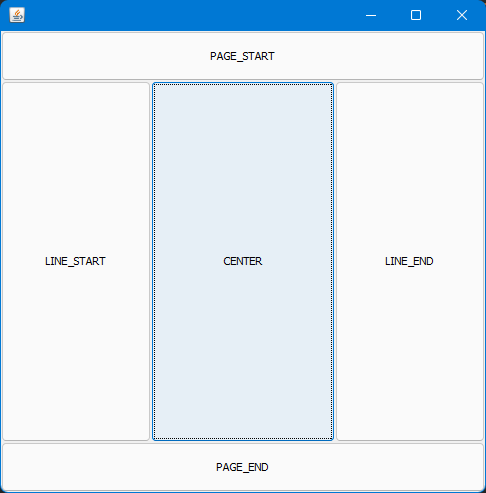

Menedżer układu
===============

Dodając kolejne elementy do komponentów, należy określić sposób w jaki elementy będą ułożone wewnątrz komponentu.

Na poziomie komponentu kontenera należy więc określić klasę menedżera układu, co pozwala na określenie sposobu pozycjonowania komponentów należących do kontenera.

https://docs.oracle.com/javase/tutorial/uiswing/layout/visual.html

W przypadku tworzenia okien przy użyciu projektanta, menedżer układu ustawia się jako właściwość komponentu **Layout Manager**.


W przypadku okien tworzonych bez użycia kreatora, należy posłużyć się metodą ``setLayout``.

```java
panelMain.setLayout(new BorderLayout());
```

Można używać różnych układów w różnych kontenerach, np. na poziomie głównego kontenera można zdecydować się na układ **BorderLayout**, zaś w kontenerze zajmującym centralną część użyć układu **FlowLayout**, itd.

Dodając komponenty do kontenera o określonym menedżerze układu, należy użyć metody ``add`` przyjmującej jako drugi argument obiekt reprezentujący ograniczenie układu.

```java
// przykład dla BorderLayout
panelMain.add(labelText, BorderLayout.CENTER);
```

```java
// przykład dla FlowLayout
panelMain.add(buttonClose, FlowLayout.TRAILING);
```

Jeśli nie zostanie zdefiniowany menedżer układu, domyślnie użytym będzie **FlowLayout**.

### BorderLayout



```java
public class MainFrame extends JFrame {
    private JPanel panelContent;
    private JButton buttonPageStart;
    private JButton buttonPageEnd;
    private JButton buttonLineStart;
    private JButton buttonCenter;
    private JButton buttonLineEnd;

    public MainFrame() {
        super();

        this.panelContent = new JPanel();
        this.panelContent.setLayout(new BorderLayout());

        this.buttonPageStart = new JButton();
        this.buttonPageStart.setText("PAGE_START");
        this.buttonPageStart.setPreferredSize(new Dimension(0, 50));
        this.panelContent.add(this.buttonPageStart, BorderLayout.PAGE_START);

        this.buttonPageEnd = new JButton();
        this.buttonPageEnd.setText("PAGE_END");
        this.buttonPageEnd.setPreferredSize(new Dimension(0, 50));
        this.panelContent.add(this.buttonPageEnd, BorderLayout.PAGE_END);

        this.buttonLineStart = new JButton();
        this.buttonLineStart.setText("LINE_START");
        this.buttonLineStart.setPreferredSize(new Dimension(150, 0));
        this.panelContent.add(this.buttonLineStart, BorderLayout.LINE_START);

        this.buttonCenter = new JButton();
        this.buttonCenter.setText("CENTER");
        this.panelContent.add(this.buttonCenter, BorderLayout.CENTER);

        this.buttonLineEnd = new JButton();
        this.buttonLineEnd.setText("LINE_START");
        this.buttonLineEnd.setPreferredSize(new Dimension(150, 0));
        this.panelContent.add(this.buttonLineEnd, BorderLayout.LINE_END);

        this.setContentPane(panelContent);
        this.setMinimumSize(new Dimension(500, 500));
        this.pack();

        this.buttonCenter.requestFocusInWindow();
    }
}
```

### BoxLayout


```java
public class MainFrame extends JFrame {
    private JPanel panelContent;
    private JButton button1;
    private JButton button2;
    private JButton button3;

    public MainFrame() {
        super();

        this.panelContent = new JPanel();
        this.panelContent.setLayout(new BoxLayout(this.panelContent, BoxLayout.Y_AXIS));

        this.button1 = new JButton();
        this.button1.setText("1");
        this.button1.setMinimumSize(new Dimension(100, 50));
        this.button1.setPreferredSize(new Dimension(100, 50));
        this.button1.setMaximumSize(new Dimension(100, 50));
        this.button1.setAlignmentX(Component.CENTER_ALIGNMENT);
        this.panelContent.add(this.button1);

        this.button2 = new JButton();
        this.button2.setText("2");
        this.button2.setMinimumSize(new Dimension(100, 50));
        this.button2.setPreferredSize(new Dimension(100, 50));
        this.button2.setMaximumSize(new Dimension(Integer.MAX_VALUE, Integer.MAX_VALUE));
        this.button2.setAlignmentX(Component.LEFT_ALIGNMENT);
        this.panelContent.add(this.button2);

        this.button3 = new JButton();
        this.button3.setText("3");
        this.button3.setMinimumSize(new Dimension(100, 50));
        this.button3.setPreferredSize(new Dimension(100, 50));
        this.button3.setMaximumSize(new Dimension(100, 50));
        this.button3.setAlignmentX(Component.RIGHT_ALIGNMENT);
        this.panelContent.add(this.button3);

        this.setContentPane(panelContent);
        this.setMinimumSize(new Dimension(300, 300));
        this.pack();
    }
}
```


```java
public class MainFrame extends JFrame {
    private JPanel panelContent;
    private JButton button1;
    private JButton button2;
    private JButton button3;

    public MainFrame() {
        super();

        this.panelContent = new JPanel();
        this.panelContent.setLayout(new BoxLayout(this.panelContent, BoxLayout.X_AXIS));

        this.button1 = new JButton();
        this.button1.setText("1");
        this.button1.setMinimumSize(new Dimension(100, 50));
        this.button1.setPreferredSize(new Dimension(100, 50));
        this.button1.setMaximumSize(new Dimension(100, 50));
        this.button1.setAlignmentY(Component.CENTER_ALIGNMENT);
        this.panelContent.add(this.button1);

        this.button2 = new JButton();
        this.button2.setText("2");
        this.button2.setMinimumSize(new Dimension(100, 50));
        this.button2.setPreferredSize(new Dimension(100, 50));
        this.button2.setMaximumSize(new Dimension(Integer.MAX_VALUE, Integer.MAX_VALUE));
        this.button2.setAlignmentY(Component.TOP_ALIGNMENT);
        this.panelContent.add(this.button2);

        this.button3 = new JButton();
        this.button3.setText("3");
        this.button3.setMinimumSize(new Dimension(100, 50));
        this.button3.setPreferredSize(new Dimension(100, 50));
        this.button3.setMaximumSize(new Dimension(100, 50));
        this.button3.setAlignmentY(Component.BOTTOM_ALIGNMENT);
        this.panelContent.add(this.button3);

        this.setContentPane(panelContent);
        this.setMinimumSize(new Dimension(300, 300));
        this.pack();
    }
}
```

### GridBagLayout


```java
public class MainFrame extends JFrame {
    private JPanel panelContent;
    private JButton button1;
    private JButton button2;
    private JButton button3;
    private JButton button4;
    private JButton button5;

    public MainFrame() {
        super();

        this.panelContent = new JPanel();
        this.panelContent.setLayout(new GridBagLayout());

        GridBagConstraints constraints;

        this.button1 = new JButton("1");
        constraints = new GridBagConstraints();
        constraints.fill = GridBagConstraints.HORIZONTAL;
        constraints.weightx = 1;
        constraints.gridx = 0;
        constraints.gridy = 0;
        this.panelContent.add(this.button1, constraints);

        this.button2 = new JButton("2");
        constraints = new GridBagConstraints();
        constraints.fill = GridBagConstraints.HORIZONTAL;
        constraints.weightx = 1;
        constraints.gridx = 1;
        constraints.gridy = 0;
        this.panelContent.add(this.button2, constraints);

        this.button3 = new JButton("3");
        constraints = new GridBagConstraints();
        constraints.fill = GridBagConstraints.HORIZONTAL;
        constraints.weightx = 1;
        constraints.gridx = 2;
        constraints.gridy = 0;
        this.panelContent.add(this.button3, constraints);

        this.button4 = new JButton("4");
        constraints = new GridBagConstraints();
        constraints.fill = GridBagConstraints.HORIZONTAL;
        constraints.gridx = 0;
        constraints.gridy = 1;
        constraints.gridwidth = 3;
        constraints.ipady = 40;
        this.panelContent.add(this.button4, constraints);

        this.button5 = new JButton("5");
        constraints = new GridBagConstraints();
        constraints.fill = GridBagConstraints.HORIZONTAL;
        constraints.gridx = 2;
        constraints.gridy = 2;
        this.panelContent.add(this.button5, constraints);

        this.setContentPane(panelContent);
        this.setMinimumSize(new Dimension(300, 300));
        this.pack();
    }
}
```
