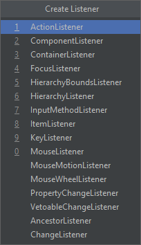

Graficzny interfejs użytkownika
===============================

JFC
---

``JFC`` to skrót od ``Java Foundation Classess``. Jest to framework, który zawiera zbiór funkcjonalności służących do budowania graficznego interfejsu użytkownika w aplikacjach. Jest częścią ``SDK``.

AWT
---

``AWT``, którego nazwa to skrót od *Abstract Window Toolkit* to najstarsza biblioteka służąca do tworzenia graficznego interfejsu użytkownika. Komponenty w tej bibliotece są zależne od platformy, zaś implementacja jest "ciężka", ze względu na użycie "pod spodem" natywnych elementów systemu operacyjnego. Jest częścią ``JDK``. Klasy ``AWT`` znajdują się w pakiecie **java.awt**.

W praktyce nie używa się komponentów wizualnych tej biblioteki w programach ``Java``, na rzecz biblioteki ``Swing``.

Chociaż większość klas ``AWT`` została zastąpiona klasami biblioteki ``Swing``, część funkcjonalności pozostała w bibliotece ``AWT``, np. ``setMinimumSize``. Również klasy obsługi zdarzeń pozostają częścią ``AWT``.

Swing
-----

``Swing`` jest biblioteką komponentów interfejsu użytkownika. Jest częścią ``JDK``. Zastępuje ona ``AWT`` i zawiera implementacje komponentów niezależnych od platformy, co umożliwia tworzenie graficznego interfejsu użytkownika, który będzie działał w różnych systemach operacyjnych jednakowo. Klasy ``Swing`` znajdują się w pakiecie **javax.swing**.

Kod źródłowy klasy korzystający z biblioteki ``Swing`` zwykle importuje przestrzeń nazw w poniższy sposób.

```java
import javax.swing.*;
```

Okna
----

W bibliotece ``Swing`` zarówno okno aplikacji jak i dialogowe jest tzw. kontenerem nawyższego poziomu.

https://docs.oracle.com/javase/tutorial/uiswing/components/toplevel.html

Klasą reprezentującą okno aplikacji jest ``JFrame``. W przypadku okna dialogowego taką klasą jest ``JDialog``.

Klasa opisująca okno aplikacji dziedziczy po klasie kontenera najwyższego poziomu.

W klasie kontenera najwyższego poziomu znajdują się dwa obiekty: obiekt zawartości okna, tzw. **Content Pane** oraz obiekt reprezentujący menu aplikacji, tzw. **Menu Bar**. Należy co najmniej wskazać odpowiedni komponent reprezentujący obiekt zawartości.

Komponenty
----------

Komponenty to elementy z których składa się graficzny interfejs użytkownika.
Do dyspozycji jest szereg podstawowych elementów takich jak panele, pola tekstowe, nowe mogą być zdefiniowane przez programistę. Komponenty dziedziczą po klasie ``JComponent`` i układane są przez mechanizm menadżera układu (layout manager) zazwyczaj w modelu pudełkowym.

| Klasa  | Nazwa    | Opis              |
| ------ | -------- | ----------------- |
| JPanel | Panel    | Kontener (panel)  |
| JLabel | Etykieta | Etykieta tekstowa |

Konwencje nazewnicze
--------------------

Nazwy klas okien, które dziedziczą po ``JFrame`` dla odróżnienia od innych klas mogą się kończyć nazwą **Frame**. Klasa okna głównego aplikacji można więc nazwać **MainFrame**. Analogicznie nazwy klas okien dialogowych mogą się kończyć nazwą **Dialog**.

Komponenty można nazywać w dowolny sposób, ale warto przyjąć konsekwentnie jeden sposób. Dobrym pomysłem może być prefiksowanie lub sufiksowanie nazw komponentów nazwą pochodzącą od rodzaju komponentu, np. **panelFirst**, **buttonFirst** lub **firstPanel**, **firstButton**, itd.

Tworzenie klasy okna
--------------------


Po tej operacji zostaną utworzone dwa pliki. Plik kodu źródłowego, gdzie znajdą się definicje komponentów, obsługa zdarzeń, oraz tak zwana logika okna oraz plik z rozszerzeniem **.form** zawierający definicję okna.


Kod źródłowy początkowo nie zawiera niczego, więc trzeba go zmodyfikować. Pierwszą rzeczą jest ustawienie dziedziczenia klasy po ``JFrame``.

```java
package org.example.test;

import javax.swing.*;

public class MainFrame extends JFrame {
}
```

Nowo utworzone okno zawiera jeden komponent klasy ``JPanel``. Nadaje się on do użycia jako obiekt zawartości.

Aby jednak było możliwe odwołanie się do obiektu reprezentującego komponent, należy go nazwać. Nie jest konieczne nadawanie nazw wszystkim komponentom. Natomiast należy je nadać wszystkim do których ma być możliwy dostęp z kodu źródłowego obsługi okna.


Po przejściu do kodu źrodłowego można zauważyć, że automatycznie pojawi się odpowiednia definicja pola w klasie.

```java
public class MainFrame extends JFrame {
    private JPanel panelMain;
}
```

Ponieważ klasa ``JPanel`` reprezentuje pusty kontener, tak utworzone okno nie będzie zawierać niczego. Na początek można więc dodać pole etykiety tekstowej.


Przy okazji można też ustawić kilka właściwości takich jak **text**, czy **font**.


Wybierając z menu kontekstowego opcję **Preview** można wyświetlić podgląd tak zdefiniowanego okna.


Na tym etapie można dokończyć podstawową edycję pliku klasy okna, dodając konstruktor, w którym powinno znaleźć się odwołanie do konstruktora klasy bazowej oraz określenie obiektu zawartości. Należy także wywołać metodę **pack()**, aby automatycznie ustawić rozmiary dla wszystkich komponentów składowych.

```java
public class MainFrame extends JFrame {
    private JPanel panelMain;
    private JLabel labelHello;

    public MainFrame() {
        super("App");
        this.setContentPane(panelMain);
        this.pack();
    }
}
```

Tak zdefiniowany konstruktor zawiera minimalną ilość kodu konieczną do użycia klasy aby utworzyć okno aplikacji.

```java
import javax.swing.*;

public class Main {
    public static void main(String[] args) {
        var frame = new MainFrame();
        frame.setDefaultCloseOperation(JFrame.EXIT_ON_CLOSE);
        frame.setVisible(true);
    }
}
```

Po uruchomieniu programu, pojawi się okno aplikacji.

Metody klasy okna
-----------------

```setVisible```

```setDefaultCloseOperation```

```setSize```

```setMinimumSize```

```setLocationRelativeTo```

```setJMenuBar```

Styl interfejsu użytkownika
---------------------------

Aby okna wyglądały "natywnie" dla systemu operacyjnego, w którym działa aplikacja, należy użyć poniższego kodu w programie.

```java
try {
    UIManager.setLookAndFeel(getSystemLookAndFeelClassName());
} catch (UnsupportedLookAndFeelException e) {
} catch (ClassNotFoundException e) {
} catch (InstantiationException e) {
} catch (IllegalAccessException e) {
}
```

Zdarzenia
---------

Załóżmy, że w projekcie okna umieszczony zostanie przycisk, a program ma odpowiednio obsłużyć akcję naciśnięcia go przez użytkownika.

Można to zrobić na kilka sposobów.

W oknie projektanta okna można zaznaczyć przycisk i wybrać z menu kontekstowego opcję **Create Listener** i wybrać **ActionListener**.



Tak utworzona akcja zostanie zdefiniowana jako przypisanie obiektu obsługi zdarzenia bezpośrednio do przycisku w konstruktorze okna.

```java
public class MainFrame extends JFrame {
    private JPanel panelMain;
    private JLabel labelHello;
    private JButton buttonBrowse;

    public MainFrame() {
        super("App");
        this.setContentPane(panelMain);
        this.pack();
        buttonBrowse.addActionListener(new ActionListener() {
            @Override
            public void actionPerformed(ActionEvent e) {
                labelHello.setText("Clicked");
            }
        });
    }
}
```

Takie rozwiązanie ma wadę, że nie jest możliwe odwołanie się w kodzie implementacji interfejsu ``ActionListener`` do obiektu klasy okna przez **this** bowiem w tym miejscu słowo to odnosić się będzie do obiektu implementującego interfejs ``ActionListener``.

Zamiast tego, można kod ten przenieść do metody klasy okna pełniącego rolę obsługi zdarzenia (handler).

```java
public class MainFrame extends JFrame {
    private JPanel panelMain;
    private JLabel labelHello;
    private JButton buttonBrowse;

    public MainFrame() {
        super("App");
        this.setContentPane(panelMain);
        this.pack();
        var buttonActionListener = new ActionListener() {
            @Override
            public void actionPerformed(ActionEvent e) {
                buttonActionHandler();
            }
        };
        buttonBrowse.addActionListener(buttonActionListener);
    }

    private void buttonActionHandler() {
        this.labelHello.setText("Clicked");
    }
}
```

Ten sposób może się przydać aby przypisać jeden kod obsługi zdarzenia do kilku komponentów.

```java
public class MainFrame extends JFrame {
    private JPanel panelMain;
    private JLabel labelHello;
    private JButton buttonBrowse;
    private JButton buttonClose;

    public MainFrame() {
        super("App");
        this.setContentPane(panelMain);
        this.pack();
        var buttonActionListener = new ActionListener() {
            @Override
            public void actionPerformed(ActionEvent e) {
                buttonActionHandler(e);
            }
        };
        buttonBrowse.addActionListener(buttonActionListener);
        buttonClose.addActionListener(buttonActionListener);
    }

    private void buttonActionHandler(ActionEvent e) {
        JButton button = (JButton) e.getSource();
        var text = button.getText();
        this.labelHello.setText(String.format("Clicked %s", text));
    }
}
```

Innym sposobem jest implementacja interfejsu ``ActionListener`` bezpośrednio przez klasę okna.

```java
public class MainFrame extends JFrame implements ActionListener {
    private JPanel panelMain;
    private JLabel labelHello;
    private JButton buttonBrowse;
    private JButton buttonClose;

    public MainFrame() {
        super("App");
        this.setContentPane(panelMain);
        this.pack();
        buttonBrowse.addActionListener(this);
        buttonClose.addActionListener(this);
    }

    @Override
    public void actionPerformed(ActionEvent e) {
        Object o = e.getSource();
        if (o instanceof JButton) {
            JButton button = (JButton) o;
            var text = button.getText();
            this.labelHello.setText(String.format("Clicked %s", text));
        }
    }
}
```

Okno komunikatu
---------------

Standardowe okna dialogowe komunikatów udostępnia komponent klasy ``JOptionPane``. Należy użyć statycznej metody ``showMessageDialog``.

```java
JOptionPane.showMessageDialog(this,
        "My message\n\nLast line",
        "Some error",
        JOptionPane.ERROR_MESSAGE);
```

https://docs.oracle.com/javase/tutorial/uiswing/components/dialog.html

Okno wyboru pliku
-----------------

Do wyświetlania okien dialogowych otwarcia lub zapisu pliku należy użyć komponentu klasy ``JFileChooser``.

```java
public class MainFrame extends JFrame {
    private JPanel panelMain;
    private JLabel labelHello;
    private JButton buttonBrowse;
    private JButton buttonClose;

    public MainFrame() {
        super("App");
        this.setContentPane(panelMain);
        this.pack();
        buttonBrowse.addActionListener(new ActionListener() {
            /**
             * Invoked when an action occurs.
             *
             * @param e the event to be processed
             */
            @Override
            public void actionPerformed(ActionEvent e) {
                buttonBrowseAction();
            }
        });
    }

    private void buttonBrowseAction() {
        var fileChooser = new JFileChooser();
        fileChooser.setCurrentDirectory(new File(System.getProperty("user.home")));
        int result = fileChooser.showOpenDialog(this);
        if (result == JFileChooser.APPROVE_OPTION) {
            File selectedFile = fileChooser.getSelectedFile();
            this.labelHello.setText("Selected file: " + selectedFile.getAbsolutePath());
        }
    }
}
```

Obiekt komponentu można zapamiętać i przechować w prywatnym polu klasy okna aby przy ponownym otwarciu okna wyboru pliku aplikacja zapamiętała ostatnio używany katalog.

```java
private JFileChooser fileChooser;

private JFileChooser getFileChooser() {
    if (fileChooser == null) {
        this.fileChooser = new JFileChooser();
        fileChooser.setCurrentDirectory(new File(System.getProperty("user.home")));
    }
    return fileChooser;
}

private void buttonBrowseAction() {
    var fileChooser = getFileChooser();
    int result = fileChooser.showOpenDialog(this);
    if (result == JFileChooser.APPROVE_OPTION) {
        File selectedFile = fileChooser.getSelectedFile();
        this.labelHello.setText("Selected file: " + selectedFile.getAbsolutePath());
    }
}
```

Menu aplikacji
--------------

Środowisko **IntelliJ** nie wspiera niestety graficznego tworzenia menu aplikacji, jest to możliwe jedynie w wersji komercyjnej. Należy utworzyć menu programowo i wykorzystać metodę ``setJMenuBar`` klasy ``JFrame``.

```java
private JMenuBar createMenu() {
   var menuBar = new JMenuBar();
   var menuFile = new JMenu("File");
   var menuFileNew = new JMenuItem("New");
   var menuFileQuit = new JMenuItem("Quit");
   menuFileQuit.setAccelerator(KeyStroke.getKeyStroke(KeyEvent.VK_Q, KeyEvent.CTRL_DOWN_MASK));
   var menuHelp = new JMenu("Help");
   var menuHelpAbout = new JMenuItem("About");
   menuHelpAbout.setIcon(null);
   menuFile.add(menuFileNew);
   menuFile.addSeparator();
   menuFile.add(menuFileQuit);
   menuHelp.add(menuHelpAbout);
   menuBar.add(menuFile);
   menuBar.add(menuHelp);
   return menuBar;
}
```

Menu kontekstowe
----------------
