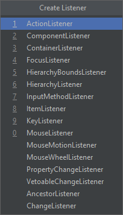

Obsługa zdarzeń
===============

Załóżmy, że w projekcie okna umieszczony zostanie przycisk, a program ma odpowiednio obsłużyć akcję naciśnięcia go przez użytkownika.

Można to zrobić na kilka sposobów.

W oknie projektanta okna można zaznaczyć przycisk i wybrać z menu kontekstowego opcję **Create Listener** i wybrać **ActionListener**.



Tak utworzona akcja zostanie zdefiniowana jako przypisanie obiektu obsługi zdarzenia bezpośrednio do przycisku w konstruktorze okna.

```java
public class MainFrame extends JFrame {
    private JPanel panelMain;
    private JLabel labelHello;
    private JButton buttonBrowse;

    public MainFrame() {
        super("App");
        this.setContentPane(panelMain);
        this.pack();
        buttonBrowse.addActionListener(new ActionListener() {
            @Override
            public void actionPerformed(ActionEvent e) {
                labelHello.setText("Clicked");
            }
        });
    }
}
```

Takie rozwiązanie ma wadę, że nie jest możliwe odwołanie się w kodzie implementacji interfejsu ``ActionListener`` do obiektu klasy okna przez **this** bowiem w tym miejscu słowo to odnosić się będzie do obiektu implementującego interfejs ``ActionListener``.

Zamiast tego, można kod ten przenieść do metody klasy okna pełniącego rolę obsługi zdarzenia (handler).

```java
public class MainFrame extends JFrame {
    private JPanel panelMain;
    private JLabel labelHello;
    private JButton buttonBrowse;

    public MainFrame() {
        super("App");
        this.setContentPane(panelMain);
        this.pack();
        var buttonActionListener = new ActionListener() {
            @Override
            public void actionPerformed(ActionEvent e) {
                buttonActionHandler();
            }
        };
        buttonBrowse.addActionListener(buttonActionListener);
    }

    private void buttonActionHandler() {
        this.labelHello.setText("Clicked");
    }
}
```

Ten sposób może się przydać aby przypisać jeden kod obsługi zdarzenia do kilku komponentów.

```java
public class MainFrame extends JFrame {
    private JPanel panelMain;
    private JLabel labelHello;
    private JButton buttonBrowse;
    private JButton buttonClose;

    public MainFrame() {
        super("App");
        this.setContentPane(panelMain);
        this.pack();
        var buttonActionListener = new ActionListener() {
            @Override
            public void actionPerformed(ActionEvent e) {
                buttonActionHandler(e);
            }
        };
        buttonBrowse.addActionListener(buttonActionListener);
        buttonClose.addActionListener(buttonActionListener);
    }

    private void buttonActionHandler(ActionEvent e) {
        JButton button = (JButton) e.getSource();
        var text = button.getText();
        this.labelHello.setText(String.format("Clicked %s", text));
    }
}
```

Innym sposobem jest implementacja interfejsu ``ActionListener`` bezpośrednio przez klasę okna.

```java
public class MainFrame extends JFrame implements ActionListener {
    private JPanel panelMain;
    private JLabel labelHello;
    private JButton buttonBrowse;
    private JButton buttonClose;

    public MainFrame() {
        super("App");
        this.setContentPane(panelMain);
        this.pack();
        buttonBrowse.addActionListener(this);
        buttonClose.addActionListener(this);
    }

    @Override
    public void actionPerformed(ActionEvent e) {
        Object o = e.getSource();
        if (o instanceof JButton) {
            JButton button = (JButton) o;
            var text = button.getText();
            this.labelHello.setText(String.format("Clicked %s", text));
        }
    }
}
```
