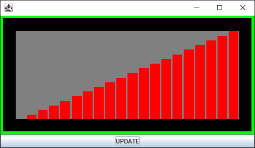
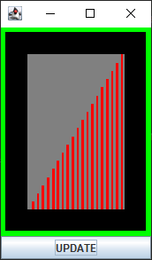
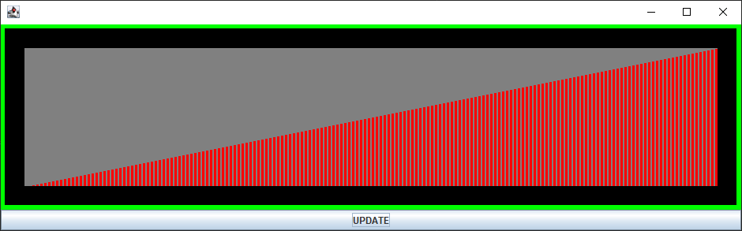

Tworzenie komponentu
====================

Tworzenie własnego komponentu polega na utworzeniu klasy dziedziczącej po klasie JComponent lub pochodnej.

JComponent
----------

Dziedzicząc po klasie podstawowej ``JComponent`` uzyskujemy pełną kontrolę jak komponent ma się zachowywać.

JPanel
------

Dziedzicząc komponent ``JPanel`` uzyskujemy domyślne rysowanie tła wraz z innymi cechami komponentu.

Kod
---

```java
public class Component extends JPanel {

    private JLabel label;
    private JTextField text;

    public Component() {
        super();
        setLayout(new BorderLayout());
        label = new JLabel("Label");
        text = new JTextField();
        add(label, BorderLayout.LINE_START);
        add(text, BorderLayout.CENTER);
    }

}
```

```java
public class Frame extends JFrame {

    public Frame() {
        super();
        setPreferredSize(new Dimension(300, 200));
        JPanel contentPanel = new JPanel();
        contentPanel.setLayout(new GridLayout(2, 1));
        Component c1 = new Component();
        contentPanel.add(c1);
        Component c2 = new Component();
        contentPanel.add(c2);
        setContentPane(contentPanel);
        pack();
    }

}
```

```java
public class Main {

    public static void main(String[] args) {
        Frame frame = new Frame();
        frame.setLocationRelativeTo(null);
        frame.setDefaultCloseOperation(JFrame.EXIT_ON_CLOSE);
        frame.setVisible(true);
    }

}
```

Przykład
--------

Komponent reprezentujący tablicę elementów typu ``int`` lub ``double``.







```java
public class ArrayDiagram extends JComponent {

    //region Constructor

    public ArrayDiagram() {
        super();
    }

    //endregion

    private double[] data;

    public static final Color TRANSPARENT = new Color(0, 0, 0, 0);

    public enum PeekPolicy {
        TAKE_FIRST,
        TAKE_MIDDLE,
        TAKE_LAST,
        TAKE_AVERAGE,
    }

    public static class InvalidTypeException extends Exception {
        public InvalidTypeException(String message) {
            super(message);
        }
    }

    //region BackgroundColor

    private Color backgroundColor = Color.WHITE;

    public Color getBackgroundColor(Color color) {
        return this.backgroundColor;
    }

    public void setBackgroundColor(Color color) {
        this.backgroundColor = color;
        this.repaint();
    }

    //endregion

    //region BorderColor

    private Color borderColor = Color.BLUE;

    public Color getBorderColor(Color color) {
        return borderColor;
    }

    public void setBorderColor(Color color) {
        this.borderColor = color;
        this.repaint();
    }

    //endregion

    //region BorderThickness

    private int borderThickness = 1;

    public int getBorderThickness() {
        return borderThickness;
    }

    public void setBorderSize(int borderThickness) {
        this.borderThickness = borderThickness;
        this.repaint();
    }

    //endregion

    //region Padding

    private int padding = 0;

    public int getPadding() {
        return padding;
    }

    public void setPadding(int padding) {
        this.padding = padding;
        this.repaint();
    }

    //endregion

    //region BoardColor

    private Color boardColor = TRANSPARENT;

    public Color getBoardColor() {
        return boardColor;
    }

    public void setBoardColor(Color boardColor) {
        this.boardColor = boardColor;
        this.repaint();
    }

    //endregion

    //region LineColor

    private Color lineColor = Color.RED;

    public Color getLineColor() {
        return lineColor;
    }

    public void setLineColor(Color lineColor) {
        this.lineColor = lineColor;
        this.repaint();
    }

    //endregion

    //region LineSpacing

    private int lineSpacing = 1;

    public int getLineSpacing() {
        return lineSpacing;
    }

    public void setLineSpacing(int lineSpacing) {
        if (lineSpacing < 0) {
            lineSpacing = 0;
        }
        this.lineSpacing = lineSpacing;
        this.repaint();
    }

    //endregion

    //region LineSize

    private int lineSize = 1;

    public int getLineSize() {
        return lineSize;
    }

    public void setLineSize(int lineSize) {
        if (lineSize < 1) {
            lineSize = 1;
        }
        this.lineSize = lineSize;
        this.repaint();
    }

    //endregion

    //region PeekPolicy

    private PeekPolicy peekPolicy = PeekPolicy.TAKE_AVERAGE;

    public PeekPolicy getPeekPolicy() {
        return peekPolicy;
    }

    public void setPeekPolicy(PeekPolicy peekPolicy) {
        this.peekPolicy = peekPolicy;
        this.repaint();
    }

    //endregion

    //region RandomData

    private int randomData = 0;

    public int getRandomData() {
        return randomData;
    }

    public void setRandomData(int randomData) {
        if (randomData < 0) {
            randomData = 0;
        }
        this.randomData = randomData;
        if (randomData > 0) {
            Random r = new Random();
            //int length = 1 + r.nextInt(99);
            int length = randomData;
            double[] array = new double[length];
            for (int i = 0; i < length; i++) {
                array[i] = -100 + 200 * r.nextDouble();
            }
            this.data = array;
        }
        this.repaint();
    }

    //endregion

    @Override
    public void paintComponent(Graphics g) {
        super.paintComponent(g);
        Graphics2D g2 = (Graphics2D) g;
        g2.setPaint(this.backgroundColor);
        g2.fillRect(0, 0, getWidth(), getHeight());
        Rectangle clientRect = new Rectangle(0, 0, getWidth() - 1, getHeight() - 1);
        Stroke defaultStroke = g2.getStroke();

        if (this.borderThickness > 0) {
            g2.setStroke(new BasicStroke(this.borderThickness));
            g2.setPaint(this.borderColor);
            g2.draw(clientRect);
            g2.setStroke(defaultStroke);
        }

        int clientOffset = this.borderThickness + this.padding;
        if (clientOffset > 0) {
            clientRect.x += clientOffset;
            clientRect.y += clientOffset;
            clientRect.width -= clientOffset + clientOffset - 1;
            clientRect.height -= clientOffset + clientOffset - 1;
        }

        if (this.getBoardColor() != TRANSPARENT) {
            g2.setPaint(this.getBoardColor());
            g2.fill(clientRect);
        }

        if (this.data != null) {
            int length = this.data.length;
            double min = Double.MAX_VALUE;
            double max = Double.MIN_VALUE;
            for (int i = 0; i < length; i++) {
                if (min > this.data[i]) {
                    min = this.data[i];
                }
                if (max < this.data[i]) {
                    max = this.data[i];
                }
            }
            double range = max - min;
            if (range > 0.01) {
                g2.setPaint(this.lineColor);
                g2.setStroke(new BasicStroke(0));
                int size = clientRect.width;
                int height = clientRect.height;

                int capacity = (int) ((size + this.lineSpacing) / (this.lineSize + this.lineSpacing));

                int count = length < capacity ? length : capacity;

                double pointWidth = 1.0 * (size - (count - 1) * this.lineSpacing) / count;
                double x = 0;
                double n = 0;
                double m = 1.0 * length / capacity;
                for (int i = 0; i < count; i++) {
                    int w = (int) Math.floor(x + pointWidth);
                    double v = length < capacity ? this.data[i] : getPointValue((int)n, (int)m);
                    int h = (int) (height * (v - min) / range);
                    if (x >= size - 1) {
                        break;
                    }
                    if (w > size) {
                        w = size;
                    }
                    Rectangle r = new Rectangle(clientRect.x + (int) x, clientRect.y + height - h, (int)(w - x), h);
                    g2.fill(r);
                    x += this.lineSpacing + pointWidth;
                    n += m;
                }
            }
        }
    }

    private double getPointValue(int n, int m) {
        if (m < 1) {
            return data[n];
        }
        int l = data.length;
        switch (this.peekPolicy) {
            case TAKE_FIRST:
                return data[n];
            case TAKE_LAST:
                return data[n+m >= l ? n : n+m];
            case TAKE_MIDDLE:
                return data[n + m/2];
        }
        int c = 0;

        double y = 0;
        while (c < m && c < l) {
            y += data[n + c];
            c++;
        }
        y /= c;
        return y;
    }

    @Override
    public Dimension getPreferredSize() {
        return new Dimension(100, 60);
    }

    public void setData(Object data) throws NullPointerException, InvalidTypeException {
        if (data == null) {
            throw new NullPointerException();
        }
        if (!data.getClass().isArray()) {
            throw new InvalidTypeException("Data must be array");
        }
        if (data instanceof double[]) {
            int length = ((double[]) data).length;
            if (length == 0) {
                this.data = null;
            } else {
                this.data = Arrays.copyOf((double[]) data, length);
            }
            this.repaint();
        } else if (data instanceof int[]) {
            int length = ((int[]) data).length;
            if (length == 0) {
                this.data = null;
            } else {
                this.data = Arrays.stream((int[]) data).asDoubleStream().toArray();
            }
            this.repaint();
        } else {
            throw new InvalidTypeException("Only int[] and double[] are supported");
        }
    }
}
```
