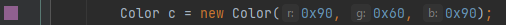
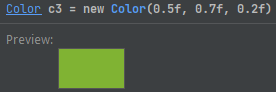
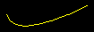
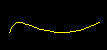
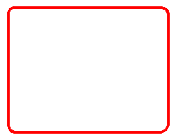
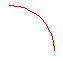
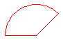

Funkcje graficzne
=================

Aby zrealizować funkcje graficzne w środowisku ``Swing`` należy przeładować metodę ``paintComponent`` komponentu w obrębie którego będzie realizowane rysowanie grafiki.

Poniższy przykład obejmuje stworzenie klasy komponentu ``Paint`` oraz klasy okna ``Frame`` zawierającego tylko jeden komponent ustawiony jako główny komponent zawartości.

Aby przerysować zawartość komponentu należy użyć metody ``repaint`` klasy komponentu.

```java
public class Main {

    public static void main(String[] args) {
        Frame frame = new Frame();
        frame.setLocationRelativeTo(null);
        frame.setDefaultCloseOperation(JFrame.EXIT_ON_CLOSE);
        frame.setVisible(true);
    }

}
```

```java
public class Frame extends JFrame {

    public Frame() {
        super();
        Paint canvas = new Paint();
        setContentPane(canvas);
        pack();
    }

}
```

```java
public class Paint extends JPanel {

    public void paintComponent(Graphics g) {
        super.paintComponent(g);
        Graphics2D g2 = (Graphics2D) g;
        g2.setPaint(Color.BLACK);
        g2.fillRect(0, 0, getWidth(), getHeight());
    }

    @Override
    public Dimension getPreferredSize() {
        return new Dimension(400, 300);
    }

}
```

https://docs.oracle.com/javase/7/docs/api/java/awt/Graphics2D.html

## Kontekst graficzny

Funkcje graficzne realizowane są przez obiekt reprezentujący kontekst graficzny. W metodzie ``paintComponent`` komponentu przekazywany jest obiekt ``g``.
W powyższym przykładzie aby uzyskać dostęp do funkcji rysowania, obiekt ``g`` jest rzutowany na klasę ``Graphics2D``, która zawiera zestaw funkcji graficznych.  


## Kolory

Barwa koloru jest reprezentowana przez klasę ``Color``. Można utworzyć obiekt reprezentujący kolor na kilka sposobów.

Użycie predefiniowanych stałych klasy ``Color``.
Preferowane jest użycie nazw pisanych dużymi literami według konwencji nazewniczej dla stałych, chociaż klasa ``Color`` zawiera definicje pisane małymi literami, więc obie konwencje są poprawne.

```java
Color c1 = Color.RED;
Color c2 = Color.GREEN;
Color c3 = Color.BLUE;
```

```java
Color c4 = Color.white;
Color c5 = Color.black;
Color c6 = Color.yellow;
```

Użycie konstruktora klasy ``Color`` z podaniem wartości składowych RGB.

```java
Color c1 = new Color(0x90, 0x60, 0x90);
Color c2 = new Color(240, 100, 80);
Color c3 = new Color(0.5f, 0.7f, 0.2f);
```

Edytor IntelliJ IDEA może dodatkowo pokazać ikonkę koloru reprezentowanego przez obiekt klasy ``Color`` jak w poniższym przykładzie.





## Gradienty

Przy pomocy klasy ``GradientPaint`` można zdefiniować przejście koloru.

```
GradientPaint gradBlueRed = new GradientPaint(10, 10, Color.BLUE, 100, 100, Color.RED);
g2.setPaint(gradBlueRed);
g2.fill(new Ellipse2D.Double(10, 10, 100, 100));
```

## Teksturowanie

Aby wypełnić kształt wzorem pochodzącym z danych obrazka (tekstury) należy użyć klasy ``TexturePaint``.


## Obrysowywanie

Używając metody ``setStroke`` można określić grubość obrysu dla funkcji ``draw`` lub bardziej zaawansowany wzór wypełnienia.

```java
g2.setPaint(Color.RED);
g2.setStroke(new BasicStroke(10));
Shape shape = new Rectangle2D.Double(10, 10, 80, 40);
g2.draw(shape);
```

```java
g2.setPaint(Color.BLACK);
float dash1[] = {3.0f};
BasicStroke dashed = new BasicStroke(1.0f,
        BasicStroke.CAP_BUTT,
        BasicStroke.JOIN_MITER,
        10.0f, dash1, 0.0f);
g2.setStroke(dashed);
g2.draw(new RoundRectangle2D.Double(10, 10, 150, 100, 10, 10));
```

https://docs.oracle.com/javase/tutorial/2d/geometry/strokeandfill.html

## Kształty

Kształty to obiekty klas implementujących interfejs ``Shape``.
Obiekty takie można rysować w trybie obrysu ``draw`` lub wypełnienia ``fill`` przy użyciu obiektu reprezentującego kontekst graficzny.

### Punkty

Pojedynczy punkt reprezentowany jest przy użyciu klasy ``Point2D`` i jednej z jej podklas ``Double`` lub ``Float`` przeznaczonych do zastosowań, gdzie koordynaty są reprezentowane przez liczby odpowiednio podwójnej i pojedynczej precyzji.

Klasa ta nie implementuje interfejsu ``Shape``, więc nie można użyć obiektu tej klasy do narysowania pojedynczego punktu. Może być natomiast przydatna przy konstruowaniu bardziej złożonych kształtów oraz mierzenia odległości.

```java
Point2D.Double p1 = new Point2D.Double(5, 5);
Point2D.Double p2 = new Point2D.Double(10, 10);
System.out.println(p1.distance(p2));
```

```
7.0710678118654755
```

Aby narysować pojedynczy punkt należy użyć innych klas reprezentujących kształt linii bądź prostokąta.

```java
Point2D.Double p1 = new Point2D.Double(5, 5);
Point2D.Double p2 = new Point2D.Double(10, 10);
g2.setPaint(Color.RED);
g2.drawLine((int)p1.x, (int)p1.y, (int)p1.x, (int)p1.y);
g2.setPaint(Color.GREEN);
g2.drawRect((int)p2.x, (int)p2.y, 0, 0);
```

### Linie

Kształt linii jest reprezentowany przez klasę ``Line2D`` w analogiczny sposób jak w przypadku klasy ``Point2D``. Tutaj również są zdefiniowane podklasy ``Double`` oraz ``Float``. Obiekty tych klas mogą być użyte w metodzie ``draw`` obiektu reprezentującego kontekst graficzny.

```
Line2D.Double l1 = new Line2D.Double(15, 15, 100, 50);
g2.setPaint(Color.YELLOW);
g2.draw(l1);
```

### Krzywe

Do rysowania krzywych używane są klasy ``QuadCurve2D`` oraz ``CubicCurve2D``.

```java
QuadCurve2D q = new QuadCurve2D.Double(10, 20, 20, 50, 100, 10);
g2.setPaint(Color.YELLOW);
g2.draw(q);
```



```java
CubicCurve2D q = new CubicCurve2D.Double();
q.setCurve(10, 40, 20, 10, 40, 60, 100, 30);
g2.setPaint(Color.YELLOW);
g2.draw(q);
```



## Prostokąty

Do określania prostokątów służy klasa ``Rectangle2D``.

```java
g2.setPaint(Color.RED);
g2.setStroke(new BasicStroke(10));
Shape shape = new Rectangle2D.Double(10, 10, 80, 40);
g2.draw(shape);
```


## Prostokąty zaokrąglone

Do określania prostokątów z zaokrąglonymi rogami służy klasa ``RoundRectangle2D``.

```java
g2.setPaint(Color.RED);
g2.setStroke(new BasicStroke(3));
g2.draw(new RoundRectangle2D.Double(20, 20, 180, 140, 15, 15));
```



## Elipsy

Do reprezentowania kształtu elipsy służy klasa ``Ellipse2D``. Tworząc obiekt tej klasy określa się prostokąt w który wpisana zostanie elipsa. Aby uzyskać okrąg, należy zachować proporcje kwadratu.

```java
g2.setPaint(Color.RED);
g2.draw(new Ellipse2D.Double(10, 10, 90, 90));
```

## Łuki

Aby narysować wycinek elipsy lub okręgu, należy użyć klasy ``Arc2D``.

```java
g2.draw(new Arc2D.Double(10, 10, 90, 90, 0, 90, Arc2D.OPEN));
```



```java
g2.draw(new Arc2D.Double(10, 10, 90, 90, 45, 135, Arc2D.PIE));
```



## Teksty

Do rysowania tekstu służy metoda ``drawString``.

```java
Font font = new Font("Segoe UI", Font.BOLD, 36);
g2.setFont(font);
g2.setColor(Color.WHITE);
g2.drawString("Zażółć gęślą jaźń", 0, 50);
```


Rysowanie tekstu odbywa się według położenia lewego górnego rogu. Do pozycjonowania można wykorzystać informację zwracaną w metodzie ``getFontMetrics``.

```java
Rectangle r = new Rectangle(20, 20, getWidth() - 40, getHeight() - 40);
Font f = new Font("Arial", Font.PLAIN, 36);
g2.setFont(f);
FontMetrics m = g2.getFontMetrics();
Rectangle2D t = m.getStringBounds(s, g2);

int x = (int)((r.getWidth() - t.getWidth()) / 2);
int y = (int)((r.getHeight()) / 2);

g.drawString(s, r.x + x, r.y + y);
```

## Obrazki

```java
BufferedImage image = null;
try {
   ClassLoader loader = Thread.currentThread().getContextClassLoader();
   URL url = loader.getResource("duke.png");
   image = ImageIO.read(url);
} catch (IOException e) {
   e.printStackTrace();
}
if (image != null) {
   g2.drawImage(image, 0, 0, this);
}
```

## Jakość

Aby poprawić jakość rysowania można włączyć tryb antyaliasingu (wygładzania krawędzi) oraz inne opcje kontrolujące jakość.

```java
g2.setRenderingHint(RenderingHints.KEY_ANTIALIASING, RenderingHints.VALUE_ANTIALIAS_ON);
```

https://docs.oracle.com/javase/tutorial/2d/advanced/quality.html

## Wydajność

W przypadku gdy rysowanie obejmuje dużą ilość operacji, w celu uniknięcia efektu "migotania" można włączyć tzw. "podwójne buforowanie".

```java
RepaintManager.currentManager(this).setDoubleBufferingEnabled(true);
```

https://www.oracle.com/java/technologies/painting.html
