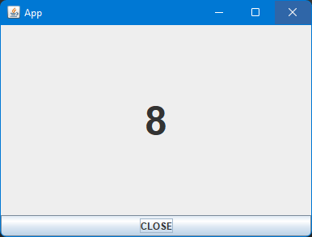
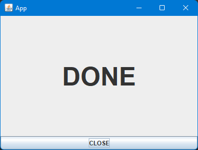

Ćwiczenia
=========

Lab 01
------

Nowy projekt, zbudowanie go i uruchomienie w środowisku programistycznym.

Podstawowe informacje na temat pracy w środowisku zintegrowanym.

Lab 02
------

Podstawy tworzenia klas.


Klasa bazowa: ``Person``

Klasa składowa: ``Address``

Klasy pochodne:

 - ``Customer``

 - ``Employee``

 - ``Student``

 - ``Teacher``

Klasa bazowa: ``Animal``

Klasy pochodne:

 - ``Cat``

 - ``Dog``

Klasa bazowa: ``Vehicle``

Klasy pochodne:

- ``Car``

- ``Truck``

- ``Train``

Lab 03
------

Dziedziczenie oraz interfejsy.

Korzystanie z obiektów posługując się interfejsami lub klasami abstrakcyjnymi.

Użycie klas specjalizowanych, list oraz map.

Rodzina artykułów spożywczych.

Klasa bazowa produktu ``Product``.

Interfejs ``Eatable``

Klasa pochodna owocu ``Fruit`` implementująca interfejs ``Eatable``

Klasa pochodna warzywa ``Vegetable`` implementująca interfejs ``Eatable``

Lab 04
------

Projekt realizujący porównanie kilku podstawowych algorytmów obliczeniowych.

Program powinien wyświetlić winietę (informację początkową), a następnie umożliwić wybór algorytmu obliczeniowego.

Po wybraniu algorytmu program powinien pozwolić na wprowadzenie parametrów dla algorytmu.

Przykładowe algorytmy:

 - potęgowanie metodą iteracji

 - potęgowanie metodą rekurencji

 - silnia metodą interacji

 - silnia metodą rekurencji

 - ciąg Fibonacciego metodą iteracji

 - ciąg Fibonacciego metodą rekurencji

 - algorytm Euklidesa (największy wspólny dzielnik)


Lab 05
------

Pliki

Odczyt istniejącego pliku, zapis nowego pliku.

### Zadanie 1

Program zliczający wystąpienia cyfr, liter oraz słów.

Korzystając z ``System.getProperty()`` program powinien wypisać bieżącą ścieżkę roboczą.

Program powinien pobrać ścieżkę dostępu do pliku z pierwszego argumentu uruchomienia i wypisać ją.

Następnie powinien odczytać plik i zliczyć wystąpienia cyfr, liter oraz słów. Należy przyjąć, że słowo to ciąg składający się z co najmniej jednego *niebiałego* znaku. Wyniki należy wypisać.

Plik testowy należy zapisać w katalogu roboczym programu.

```
Lorem ipsum dolor sit amet, consectetur adipiscing elit. Nullam facilisis sit amet mi ac vestibulum. Vestibulum convallis odio at cursus facilisis. Vivamus ultrices velit in arcu ornare, ut mollis tortor blandit. Nulla facilisi. Nulla placerat feugiat ipsum, eget faucibus risus scelerisque rutrum. Mauris in orci ex. Praesent ornare mauris id sodales viverra.

127.0.0.1 2021 11 25

Donec laoreet sagittis mollis. Nunc suscipit libero ut enim dapibus, et malesuada lectus mattis. Nunc maximus pharetra gravida. In vitae tortor justo. In mi nisi, euismod sit amet nunc et, interdum ullamcorper elit. Mauris tempor purus vel nisl vehicula tincidunt.
```

### Zadanie 2

Program zapisujący do pliku bieżącą datę oraz czas z opcjonalnym przesunięciem podanym w argumencie uruchomienia jako ilość dni w przyszłość lub wstecz dla wartości ujemnych.

Nazwa pliku wyjściowego powinna być podana w pierwszym parametrze uruchomienia. Opcjonalne przesunięcie powinno być pobrane z drugiego parametru uruchomienia.

Lab 06
------

Podstawy tworzenia graficznego interfejsu użytkownika przy użyciu komponentów biblioteki ``Swing``.

### Zadanie 1

Utworzenie klasy okna aplikacji przy użyciu kreatora.

### Zadanie 2

Utworzenie klasy okna aplikacji programowo.

Lab 07
------

### Zadanie 1

Programowe utworzenie i wyświetlenie okna logowania się do aplikacji.
Okno powinno być wyświetlone na środku ekranu, zawierać etykietki "Użytkownik" oraz "Hasło" wraz z polami edycyjnymi oraz przyciski "Ok", "Zamknij".
Przycisk "Ok" powinien być aktywny tylko w przypadku obu wypełnionych pól.
Przycisk "Zamknij" powinien zakończyć działanie programu.

### Zadanie 2

Programowe utworzenie okna aplikacji, użycie klasy ``Timer`` oraz dodanie obsługi zdarzenia wyświetlenia okna.

Należy utworzyć klasę okna w którym znajdzie się etykietka tekstowa oraz przycisk. Naciśnięcie przycisku powinno spowodować zamknięcie okna. Po wyświetleniu okna należy rozpocząć odliczanie i wyświetlać kolejne wartości w etykietce. Po osiągnięciu minimalnej wartości należy zatrzymać odliczanie.





Lab 08
------

Wyrażenia regularne.

### Zadanie 1

Stworzyć projekt aplikacji do testowania dopasowań według wzorca.

Okno aplikacji powinno zawierać pole tekstowe tekstu dopasowywanego, pole kombi dla wzorca dopasowania z listą kilku gotowych wzorców (np. ``[0-9]+``, ``[a-z]+``), pola listy wyniku oraz przycisku umożliwiającego wykonanie dopasowania.


### Zadanie 2

Utworzyć odpowiednie wyrażenia regularne dla dopasowania:

 - adresu e-mail
 - numeru telefonu
 - nazwy hosta
 - adresu IP

Lab 09
------

Tworzenie własnych komponentów.

### Zadanie

Utworzyć klasę komponentu zawierającą pole etykiety tekstowej ``JLabel`` oraz okno edycyjne ``JTextField``. Komponent powinien "wystawić" publicznie funkcjonalność ustawienia tekstu etykietki oraz zawartości pola tekstowego.

Utworzyć okno aplikacji zawierające kilka instancji komponentów.

Lab 10
-------

Podstawy tworzenia grafiki z wykorzystaniem Swing.

### Zadanie

Utworzyć aplikację wyświetlającą okno wyświetlającej wykres znanej funkcji matematycznej, np. ``sin(α)``.

Korzystając z komponentu ``Timer`` można "ożywić" wykres zmieniając parametr funkcji wykresu, np. ``sin(α + φ)``.

Lab 11
------

Wyświetlanie sekwencji obrazków umieszczonych w zasobach aplikacji.

Lab 12
------

Połączenia sieciowe.

### Zadanie 1

Wykonać połączenie do API pod URL http://api.zpsb.alyx.pl/ i pobrać wynik w formie tekstowej.

Wyciągnąć z tekstu znacznik czasowy "Time: RRRR-MM-DD gg:mm:ss" i wyświetlić go.

```bash
curl api.zpsb.alyx.pl
```

```
Hello: Anonymous
Time: 2021-12-12 13:03:11.049
Bye: Anonymous
```

### Zadanie 2

Wykonać połączenie do API pod URL http://api.zpsb.alyx.pl/json/ i pobrać wynik JSON.

Wynik należy zdeserializować do obiektu i wyświetlić pola tekstowe.

```json
{
    "time": "2022-02-02 03:14:15.926",
    "author": "Nelson Mandela",
    "text": "A winner is a dreamer who never gives up."
}
```

Lab 13
------

Programowanie wielowątkowe.

### Zadanie 1

Utworzyć wątek roboczy implementujący interfejs ``Runnable`` i wykonujący pewne długotrwałe obliczenia.

Wątek roboczy powinien znać nadaną sobie nazwę i posłużyć się nią do wyświetlenia informacji o uruchomieniu oraz zakończeniu pracy.

Program powinien zapytać użytkownika o ilość wątków.

Zadanie polega na uruchomieniu tych wątków i zakończeniu programu po zakończeniu działania wszystkich wątków.

### Zadanie 2

Utworzyć dwa wątki, jeden tworzący nowe komunikaty i wątek obsługi, wypisujący komunikaty na ekran.

Należy użyć klasy ``Semaphore`` aby zatrzymać działanie wątku obsługi komunikatów i wznawiać jego działanie po wprowadzeniu nowych komunikatów.

Lab 14
------

Logowanie do dziennika.

### Zadanie

Napisać program, który wyprowadzi do pliku dziennika oraz konsoli dowolnie wybrany tekst przy uruchomieniu. Dziennik powinien być w formacie tekstowym zawierający wpisy w kolejnych liniach w formacie "czas komunikat". Przy kolejnym uruchomieniu wpis powinien zostać dopisany na koniec pliku.

Lab 15
------

Baza danych.
